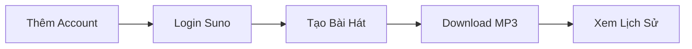

# 🎵 Suno Account Manager v2.0

> **Ứng dụng desktop quản lý tài khoản Suno.com chuyên nghiệp với tính năng tự động tạo nhạc hàng loạt, batch download, và hệ thống anti-CAPTCHA thông minh.**

<div align="center">

[](https://github.com/yourusername/Auto-Suno-App)
[](https://www.python.org/)
[](LICENSE)
[](https://www.microsoft.com/windows)

[Tính năng](#-tính-năng) • [Cài đặt](#-cài-đặt-nhanh) • [Sử dụng](#-hướng-dẫn-sử-dụng) • [Tài liệu](#-tài-liệu) • [Guide](AGENTS.md)

</div>

---

## 📋 Tổng Quan

**Suno Account Manager** là ứng dụng Windows desktop chuyên nghiệp dành cho người dùng Suno.com, cung cấp:

- 🎼 **Tạo nhạc hàng loạt** - Tự động tạo 10-50 bài từ XML với anti-CAPTCHA thông minh
- 👥 **Quản lý đa tài khoản** - Unlimited accounts với session persistence 24h
- 📥 **Batch download** - Tải hàng loạt với metadata ID3 tags đầy đủ
- 🏗️ **Clean Architecture** - Code dễ bảo trì, mở rộng và test

### 💡 Tại sao chọn Suno Account Manager?

| Thao tác thủ công | Với App này |
|-------------------|-------------|
| 5 phút/bài × 20 bài = **100 phút** | XML + Auto-fill = **30 phút** |
| Login lại mỗi ngày cho 5 accounts | Session lưu **24h** |
| Download từng bài, không metadata | Batch download + **ID3 tags** |
| CAPTCHA thường xuyên | Anti-detection = **<5% CAPTCHA** |

---

## ✨ Tính Năng

### 🎵 1. Queue System - Quản Lý Hàng Đợi Tạo Bài Thông Minh (★ V2.0 Featured)

**Tạo hàng trăm bài hát tự động với hệ thống queue management chuyên nghiệp!**

```xml
<!-- Ví dụ file XML với 100 prompts -->
<TITLE>Snowfall Dreams</TITLE>
<LYRICS>
[Verse 1]
Gentle snowflakes falling down
Silent whispers all around
</LYRICS>
<STYLE>Ambient, dreamy, piano, 90bpm</STYLE>
<!-- ... 99 prompts khác ... -->
```

**Workflow Queue System:**
1. **Upload XML** - Load 100 prompts một lần
2. **Add Queues** - Tạo nhiều queue cho nhiều accounts:
   - Account 1: 30 bài (5 bài/lần)
   - Account 2: 30 bài (6 bài/lần)  
   - Account 3: 40 bài (10 bài/lần)
3. **Select & Start** - Tick queues muốn chạy → Bắt đầu tự động
4. **Resume Support** - Dừng giữa chừng → Mở lại app → Tiếp tục
5. **History Tracking** - Xem tất cả bài đã tạo với metadata đầy đủ

**Tính năng nổi bật:**
- ✅ **Multi-Queue Management** - Tạo nhiều queue cho nhiều accounts khác nhau
- ✅ **Batch Optimization** - Tự động chia nhỏ thành batches (1-10 bài/lần)
- ✅ **State Persistence** - Lưu trạng thái queue, resume khi restart app
- ✅ **Progress Tracking** - Real-time progress cho từng queue + tổng thể
- ✅ **Error Recovery** - 1 bài fail không ảnh hưởng các bài còn lại
- ✅ **History Panel** - Xem lịch sử tạo bài, export CSV với timestamp
- ✅ **Smart Validation** - Không cho phép vượt quá số prompts đã upload

**Use Case thực tế:**
```
Content Creator với 3 accounts, 100 bài hát:
  Thủ công: 5 phút/bài × 100 = 500 phút (8.3 giờ)
  Với Queue System: 
    - Upload 100 prompts → 2 phút
    - Setup 3 queues → 1 phút
    - Auto-create (3 accounts parallel) → 120 phút (2 giờ)
  ➜ Tiết kiệm: 380 phút (~6 giờ, 75%)
```

**Advanced Options (7 settings):**
- ✅ Weirdness (0-100): Độ "kỳ lạ" của bài hát
- ✅ Creativity (0-100): Mức độ sáng tạo
- ✅ Clarity (0-100): Độ rõ ràng lời hát
- ✅ Model: v4, v3.5, v3
- ✅ Vocal Gender: Auto, Male, Female
- ✅ Lyrics Mode: Auto, Manual
- ✅ Style Influence (0-100): Ảnh hưởng của style tag

### 🎼 2. Single Song Creation (Simple Mode)

**Tạo đơn lẻ với UI đơn giản - Phù hợp khi test prompt nhanh!**

- ✅ Parse XML với cấu trúc `<TITLE>`, `<LYRICS>`, `<STYLE>`
- ✅ Auto-fill form với human-like delays (3-5s ngẫu nhiên)
- ✅ Hỗ trợ Persona (optional)
- ✅ Preview bài hát đã tạo với URL
- ✅ Copy XML prompt & URL với 1 click
- ✅ Stealth driver với User-Agent rotation và anti-detection

### 👤 3. Quản Lý Đa Tài Khoản

- ✅ **Unlimited accounts** - Không giới hạn số lượng tài khoản
- ✅ **Chrome profile isolation** - Mỗi account có session riêng biệt
- ✅ **Session persistence** - Lưu trạng thái 24h, không cần login lại
- ✅ **CRUD operations** - Add, Rename, Delete, Use accounts dễ dàng
- ✅ **Account info** - Hiển thị email, ngày tạo, lần dùng cuối
- ✅ **Multi-queue support** - 1 account có thể có nhiều queues đang chạy

### 📥 4. Batch Download Chuyên Nghiệp

- ✅ **Download từ /me** - Tất cả bài hát của bạn
- ✅ **Download từ profile** - Bài hát của người khác (@username)
- ✅ **Metadata embedding** - ID3 tags: Title, Artist, Thumbnail
- ✅ **Download history** - Tránh duplicate, theo dõi tiến độ
- ✅ **Progress display** - Real-time progress bar + status
- ✅ **Configurable options** - Limit, output dir, thumbnail, UUID

### 🛡️ 5. Hệ Thống Anti-CAPTCHA Thông Minh

**CAPTCHA rate < 5% với cấu hình mặc định!**

- ✅ **Stealth ChromeDriver** - Ẩn `navigator.webdriver`, mock plugins/languages
- ✅ **User-Agent Rotation** - Pool 3 Chrome versions (v129-131)
- ✅ **Human Delays** - Random 3-5s giữa các thao tác
- ✅ **Manual Submit Default** - User tự click Create (CAPTCHA risk <5%)
- ✅ **Chrome Profile Reuse** - Giữ cookies/localStorage như browser thật

**So sánh CAPTCHA rate:**

| Cấu hình | CAPTCHA Rate | Khuyến nghị |
|----------|--------------|-------------|
| Manual submit + Human delays | **< 5%** | ✅ Mặc định |
| Auto-submit + Batch size 1-2 | ~20% | ⚠️ Tốc độ cao |
| Headless + No delays | ~50%+ | ❌ Không nên |

### 📊 6. History Tracking & Export

**Theo dõi lịch sử tạo bài chuyên nghiệp!**

- ✅ **Song Creation History** - Lưu metadata mỗi bài: title, prompt XML, URLs, account, timestamp
- ✅ **Filter by Account** - Xem lịch sử theo từng account hoặc tất cả
- ✅ **Export to CSV** - Export full history với định dạng: `Date, Account, Title, Prompt, URLs`
- ✅ **Persistence** - Lịch sử được lưu trong `data/song_creation_history.json`
- ✅ **Queue Integration** - Tự động ghi nhận bài hát từ Queue System

---

## 🚀 Cài Đặt Nhanh

### Yêu Cầu Hệ Thống

- **OS**: Windows 10/11 (64-bit)
- **Python**: 3.10 hoặc cao hơn
- **Chrome**: Đã cài đặt (phiên bản bất kỳ)
- **RAM**: 4GB+ (khuyến nghị 8GB)
- **Disk**: 500MB cho app + dung lượng cho downloads

### Cài Đặt Trong 3 Bước

**1️⃣ Clone hoặc download project**

```powershell
git clone https://github.com/yourusername/Auto-Suno-App.git
cd Auto-Suno-App
```

**2️⃣ Cài đặt dependencies**

```powershell
# Khuyến nghị: tạo virtual environment
python -m venv venv
.\venv\Scripts\Activate.ps1

# Cài packages
pip install -r requirements.txt
```

**3️⃣ Chạy ứng dụng**

```powershell
python app.py
```

### Dependencies Chính

```txt
customtkinter>=5.2.0      # Modern GUI framework
selenium>=4.15.0          # Browser automation
webdriver-manager>=4.0.0  # Auto ChromeDriver management
mutagen>=1.47.0           # Audio metadata editing
requests>=2.31.0          # HTTP library
```

---

## 📖 Hướng Dẫn Sử Dụng

### 🎯 Workflow Cơ Bản



### 1️⃣ Thêm Tài Khoản Suno

1. Mở app → Tab **"🎵 Tài khoản"**
2. Click **"➕ Thêm tài khoản"**
3. Nhập tên account (ví dụ: `my_account`) và email (tùy chọn)
4. Chrome mở tự động → Login Suno.com thủ công
5. Đóng Chrome sau khi login → Account được lưu

> **💡 Tip**: Session sẽ được lưu trong `profiles/my_account/Default/` và tồn tại 24h

### 2️⃣ Tạo Hàng Loạt Bài Hát với Queue System (★ Recommended)

**Queue System cho phép tạo hàng trăm bài tự động với nhiều accounts!**

#### **Bước 1: Chuẩn bị XML file với 100 prompts**

Tạo file `prompts.xml`:

```xml
<TITLE>Snowfall Dreams</TITLE>
<LYRICS>
[Verse 1]
Gentle snowflakes falling down
Silent whispers all around

[Chorus]
Dreaming in the winter night
Everything feels so right
</LYRICS>
<STYLE>Ambient, dreamy, piano, 90bpm, ethereal</STYLE>

<TITLE>Summer Vibes</TITLE>
<LYRICS>
[Verse 1]
Sunshine on my face today
Dancing in the summer rays
</LYRICS>
<STYLE>Pop, upbeat, 120bpm, electronic, happy</STYLE>

<!-- ... 98 prompts khác ... -->
```

#### **Bước 2: Upload & Add Queues**

1. Tab **"🎼 Tạo Nhiều Bài"**
2. Click **"📁 Upload XML"** → Chọn file 100 prompts
3. Hiển thị: `"Đã load 100 prompts"`
4. **Add Queue 1:**
   - Account: `account_1`
   - Số bài hát: `30`
   - Batch size: `5` (mỗi lần tạo 5 bài)
   - Click **"➕ Thêm vào Queue"**
5. **Add Queue 2:**
   - Account: `account_2`
   - Số bài hát: `30`
   - Batch size: `6`
   - Click **"➕ Thêm vào Queue"**
6. **Add Queue 3:**
   - Account: `account_3`
   - Số bài hát: `40`
   - Batch size: `10`
   - Click **"➕ Thêm vào Queue"**

**Validation tự động:**
```
✅ Queue 1: 30 bài (account_1)
✅ Queue 2: 30 bài (account_2)
✅ Queue 3: 40 bài (account_3)
Total: 100/100 prompts
```

Nếu thêm queue 4 → **Error**: "Không đủ prompts! Còn 0/100"

#### **Bước 3: Select & Start Queues**

1. **Tick queues muốn chạy:**
   - ☑️ Queue 1 (account_1 - 30 bài)
   - ☑️ Queue 2 (account_2 - 30 bài)
   - ☐ Queue 3 (account_3 - 40 bài) ← Không chạy lần này
2. Nút **"🚀 Bắt Đầu"** sẽ enable (chỉ khi có ≥1 queue được tick)
3. Click **"🚀 Bắt Đầu"**

**Auto-execution:**
```
⏳ Đang tạo: Queue 1 - Batch 1/6 (5 bài)
   ✅ TAB 1: Snowfall Dreams
   ✅ TAB 2: Summer Vibes
   ✅ TAB 3: Moonlight Serenade
   ✅ TAB 4: Ocean Breeze
   ✅ TAB 5: City Lights

⏳ Đang tạo: Queue 1 - Batch 2/6 (5 bài)
   ...

✅ Queue 1 hoàn thành: 30/30 bài
⏳ Đang tạo: Queue 2 - Batch 1/5 (6 bài)
   ...

✅ Queue 2 hoàn thành: 30/30 bài
🎉 Tất cả queues đã hoàn thành! (60/60 bài)
```

#### **Bước 4: Resume Support (Nếu dừng giữa chừng)**

1. **Trong quá trình tạo**, click **"⏸️ Dừng"**
2. State được lưu tự động trong `data/queue_state.json`
3. **Đóng app** hoặc restart máy
4. **Mở lại app** → Tab **"🎼 Tạo Nhiều Bài"**
5. Queues được restore với trạng thái:
   ```
   ☑️ Queue 1 (account_1): 15/30 bài ← Đã tạo 15, còn 15
   ☑️ Queue 2 (account_2): 0/30 bài ← Chưa bắt đầu
   ```
6. Click **"🚀 Tiếp Tục"** → App tự động tiếp tục từ bài thứ 16

#### **Bước 5: Xem Lịch Sử & Export**

1. Tab **"📜 Lịch Sử Tạo Bài Hát"**
2. Filter theo account hoặc "All"
3. Xem danh sách 60 bài đã tạo:
   ```
   2025-11-10 14:30 | account_1 | Snowfall Dreams | <prompt_xml> | https://suno.com/song/abc123
   2025-11-10 14:32 | account_1 | Summer Vibes    | <prompt_xml> | https://suno.com/song/def456
   ...
   ```
4. Click **"📊 Export CSV"** → Lưu file `song_history_20251110_143000.csv`

### 2️⃣-B. Tạo Đơn Lẻ (Simple Mode)

**Phù hợp khi test prompt nhanh hoặc tạo 1-2 bài!**

1. Tab **"🎵 Tạo Nhạc"** (Simple mode)
2. Chọn account
3. Nhập:
   - **Persona** (optional): `Dreamy Composer`
   - **Lyrics**: Lời bài hát
   - **Styles**: `Ambient, piano, 90bpm`
   - **Title** (optional): `My Song`
4. **Advanced Options**: Weirdness, Vocal Gender, etc.
5. Click **"Tạo Bài Hát"**
6. Xem kết quả bên cột phải → Copy XML/URL

### 3️⃣ Download Bài Hát

#### 📥 Download từ /me (bài của bạn)

1. Tab **"📥 Download"**
2. Chọn account
3. ☑️ **"Bài hát của tôi (/me)"**
4. Nhập số lượng (0 = tất cả)
5. Chọn thư mục output
6. Click **"🚀 Bắt đầu tải"**

#### 👤 Download từ profile người khác

1. Bỏ tick **"Bài hát của tôi (/me)"**
2. Nhập **`@username`** trong textbox Profile
3. Các bước còn lại giống trên

**Output:**
```
downloads/
└── my_account/
    ├── snowfall-dreams-abc123.mp3  # với metadata ID3
    ├── snowfall-dreams-abc123.jpg  # thumbnail
    ├── summer-vibes-def456.mp3
    └── summer-vibes-def456.jpg
```

### 4️⃣ Xem Lịch Sử Download

1. Tab **"📜 Lịch sử"**
2. Filter theo account (hoặc All)
3. Xem danh sách bài đã tải + timestamps
4. Xóa lịch sử nếu cần (không xóa file MP3)

---

## 🎨 Giao Diện

**Dark Mode GUI với 6 Tabs:**

```
┌───────────────────────────────────────────────────────────┐
│  🎵 Suno Manager v2.0         [―] [□] [✕]                │
├──────────┬────────────────────────────────────────────────┤
│ 🎵 Tài   │  ┌─ Account Info ──────────────────────┐      │
│   khoản  │  │ Account: [thang ▼]                  │      │
│          │  │ Email: user@example.com             │      │
│ 🎼 Tạo   │  │ Created: 2025-11-09 10:30           │      │
│   Nhiều  │  │ Last Used: 2025-11-09 15:45         │      │
│   (Queue)│  └─────────────────────────────────────┘      │
│          │  [➕ Thêm] [🔄 Sử dụng] [✏️ Đổi tên] [🗑️ Xóa] │
│ 🎵 Tạo   │                                                │
│   Nhạc   │  ┌─ Queue Management ──────────────────┐      │
│  (Simple)│  │ ☑️ Queue 1: account_1 (15/30 bài)   │      │
│          │  │ ☑️ Queue 2: account_2 (0/30 bài)    │      │
│ � Down  │  │ ☐ Queue 3: account_3 (0/40 bài)    │      │
│   load   │  └─────────────────────────────────────┘      │
│          │  [🚀 Bắt Đầu] [⏸️ Dừng] [🗑️ Xóa Queue]      │
│ 📜 Lịch  │                                                │
│   sử     │  Progress: ████████░░ 50% (30/60 bài)        │
│  Download│  Status: Queue 1 - Batch 3/6...               │
│          │                                                │
│ 📜 Lịch  │                                                │
│   sử Tạo │                                                │
│   Bài    │                                                │
└──────────┴────────────────────────────────────────────────┘
```

**Tabs:**
1. **🎵 Tài khoản** - Account management (Add, Use, Rename, Delete)
2. **🎼 Tạo Nhiều Bài (Queue)** - Multi-queue batch creation system
3. **🎵 Tạo Nhạc (Simple)** - Single song creation với preview
4. **📥 Download** - Download songs từ /me hoặc profile
5. **📜 Lịch sử Download** - View download history
6. **📜 Lịch sử Tạo Bài** - Song creation history với export CSV

**Window Size**: 1400x850 pixels (responsive, resizable)

---

## 🔧 Troubleshooting

### ⚠️ Các Vấn Đề Thường Gặp

<details>
<summary><b>1. Chrome Profile Lock Error</b></summary>

**Triệu chứng:**
```
Error: Profile đang được sử dụng!
```

**Giải pháp:**
- Đóng TẤT CẢ cửa sổ Chrome đang mở
- Kiểm tra Task Manager xem có process `chrome.exe` nào còn chạy không
- Thử lại

</details>

<details>
<summary><b>2. Session Token Not Found</b></summary>

**Triệu chứng:**
```
Error: Không tìm thấy session token
```

**Giải pháp:**
- Click **"🔄 Sử dụng tài khoản"** để login lại
- Đợi 5 giây sau khi page load xong trước khi đóng browser
- Kiểm tra Chrome có block cookies không (Settings → Privacy)

</details>

<details>
<summary><b>3. CAPTCHA During Creation</b></summary>

**Triệu chứng:**
```
Turnstile CAPTCHA xuất hiện khi tạo bài
```

**Giải pháp:**
- ☐ Disable **Auto-submit** (click Create manually)
- Tăng **human delays** trong settings
- Giảm **batch size** xuống 1
- Đảm bảo Chrome profile đã login thành công trước đó

</details>

<details>
<summary><b>4. Download Failed (401 Unauthorized)</b></summary>

**Triệu chứng:**
```
Error: Session hết hạn
```

**Giải pháp:**
- Session token hết hạn sau 24h
- Click **"🔄 Sử dụng tài khoản"** để refresh session
- Login lại trong Chrome window

</details>

<details>
<summary><b>5. Module Import Error</b></summary>

**Triệu chứng:**
```
ModuleNotFoundError: No module named 'customtkinter'
```

**Giải pháp:**
```powershell
# Đảm bảo virtual environment đã activate
.\venv\Scripts\Activate.ps1

# Cài lại dependencies
pip install -r requirements.txt
```

</details>

---

## 🛡️ Bảo Mật & Lưu Ý

### ⚠️ Quan Trọng

1. **Không chia sẻ Chrome profiles** - Chứa cookies và session của bạn
2. **Gitignore sensitive files**:
   ```gitignore
   profiles/
   downloads/
   logs/
   data/*.json
   ```
3. **JWT Token có hạn** - Refresh mỗi 24h bằng cách login lại
4. **Sử dụng hợp pháp** - Chỉ dùng cho tài khoản của bạn

### 🔐 Session Management

**Suno.com sử dụng Clerk.com authentication:**

| Thành phần | Mô tả | Lifetime |
|------------|-------|----------|
| `__session` cookie | JWT token | ~24h |
| `__clerk_environment` localStorage | Clerk metadata | Persistent |

> **Tại sao dùng Chrome Profile?** Cookies alone không đủ. Clerk cần cả localStorage. Chrome `--user-data-dir` lưu toàn bộ browser state.

### 📊 Rate Limiting

**Suno API Limits** (quan sát):

| Endpoint | Rate Limit |
|----------|------------|
| `/feed/v2` | 30 req/min |
| `/clips/profile/{username}` | 60 req/min |
| `/billing/info` | 10 req/min |

**App settings:**
- Delay between downloads: 2s
- Retry attempts: 3
- Download timeout: 300s

---

## 🏗️ Architecture

### Clean Architecture Layers

```
src/
├── ui/                    # 🎨 Presentation Layer
│   ├── main_window.py             # Main app container với 6 tabs
│   ├── account_panel.py           # Account management UI
│   ├── multiple_songs_panel.py    # Queue system UI
│   ├── create_music_panel.py      # Simple creation UI
│   ├── download_panel.py          # Download configuration
│   ├── history_panel.py           # Download history
│   └── song_creation_history_panel.py  # Creation history với export CSV
│
├── core/                  # 🧠 Application Layer
│   ├── account_manager.py         # Account CRUD + persistence
│   ├── session_manager.py         # Chrome automation + tokens
│   ├── queue_manager.py           # Queue CRUD + state persistence
│   ├── batch_song_creator.py      # Multi-queue execution engine
│   ├── song_creation_history_manager.py  # History tracking
│   └── download_manager.py        # Download orchestration
│
├── models/                # 📦 Domain Layer
│   └── data_models.py             # Account, QueueEntry, SongClip, History
│
└── utils/                 # 🔧 Infrastructure Layer
    ├── logger.py                  # Singleton logger
    ├── helpers.py                 # JSON I/O utilities
    ├── stealth_driver.py          # Anti-detection ChromeDriver
    └── prompt_parser.py           # XML parsing
```

**Dependency Rules**: `UI → Core → Models → Utils` (no reverse imports)

### Key Design Patterns

- **Dependency Injection**: Managers injected into UI panels
- **Repository Pattern**: JSON files as persistent storage (`queue_state.json`, `song_creation_history.json`)
- **Observer Pattern**: Progress callbacks for UI updates
- **Singleton**: Logger instance shared across modules
- **Factory**: StealthDriver creation with random User-Agents
- **State Machine**: Queue status transitions (pending → running → completed/failed)
- **Command Pattern**: Queue operations (add, start, pause, resume, cancel)

---

## 🖥️ Giao Diện

**Dark Mode GUI với 4 Tabs:**

1. **🎵 Tài khoản**: Add, Use, Rename, Delete accounts
2. **📥 Download**: Download songs từ /me hoặc profile
3. **📜 Lịch sử**: View download history và statistics
4. **🎼 Tạo Nhiều Bài**: Batch song creation từ XML

**Window Size**: 1400x850 pixels (responsive, resizable)

---

## � Bắt Đầu Nhanh

### Yêu Cầu Hệ Thống

- **OS**: Windows 10/11 (64-bit)
- **Python**: 3.10 trở lên
- **Chrome**: Đã cài đặt (bất kỳ version)
- **RAM**: 4GB+ (8GB khuyến nghị)
- **Disk**: 500MB cho app + space cho downloads

### Cài Đặt

**Bước 1: Clone hoặc download project**
```bash
git clone https://github.com/yourusername/Auto-Suno-App.git
cd Auto-Suno-App
```

**Bước 2: Tạo virtual environment (khuyến nghị)**
```powershell
python -m venv venv
.\venv\Scripts\Activate.ps1
```

**Bước 3: Cài đặt dependencies**
```bash
pip install -r requirements.txt
```

**Dependencies chính:**
```
customtkinter>=5.2.0      # Modern GUI framework
selenium>=4.15.0          # Browser automation
webdriver-manager>=4.0.0  # Auto ChromeDriver management
mutagen>=1.47.0           # Audio metadata editing
requests>=2.31.0          # HTTP library
```

**Bước 4: Chạy ứng dụng**
```bash
python app.py
```

---

## 📖 Hướng Dẫn Sử Dụng

### 1. Thêm Tài Khoản Suno

1. Mở app → Tab **"🎵 Tài khoản"**
2. Click **"➕ Thêm tài khoản"**
3. Nhập tên account (vd: `my_account`) và email (optional)
4. Chrome mở tự động → Login Suno.com thủ công
5. Đóng Chrome sau khi login → Account được lưu

**Lưu ý**: Session sẽ được lưu trong `profiles/my_account/Default/`

### 2. Tạo Nhiều Bài Hát (Multiple Songs)

**Chuẩn bị XML file** (`prompts.xml`):
```xml
<TITLE>Song Title 1</TITLE>
<LYRICS>
[Verse 1]
First line of lyrics
Second line of lyrics
[Chorus]
Chorus lyrics here
</LYRICS>
<STYLE>Pop, upbeat, 120bpm, electronic</STYLE>

<TITLE>Song Title 2</TITLE>
<LYRICS>
[Verse 1]
Another song...
</LYRICS>
<STYLE>Rock, electric guitar, energetic</STYLE>
```

**Workflow trong GUI**:
1. Tab **"🎼 Tạo Nhiều Bài"**
2. Chọn account đã login
3. **Browse** → Chọn file XML
4. Click **"Parse & Preview"** → Kiểm tra danh sách bài
5. Cấu hình:
   - **Batch Size**: Số tabs mở đồng thời (1-5, khuyến nghị 1-2)
   - **Advanced Options**: Weirdness (0-100), Model (v4/v3.5/v3), etc.
   - **Auto-submit**: ☑️ Tự động click Create (tăng risk CAPTCHA)
   - **Keep browser open**: ☑️ Giữ browser 30s để xem kết quả
6. Click **"🚀 Bắt Đầu Tạo Bài Hát"**

**Kết quả**: App tự động điền form, submit, và track progress.

### 3. Download Bài Hát

**Download từ /me (bài của bạn)**:
1. Tab **"📥 Download"**
2. Chọn account
3. ☑️ **"Bài hát của tôi (/me)"**
4. Nhập số lượng (0 = tất cả)
5. Chọn thư mục output
6. Click **"🚀 Bắt đầu tải"**

**Download từ profile người khác**:
1. Bỏ tick **"Bài hát của tôi (/me)"**
2. Nhập **`@username`** trong textbox Profile
3. Click **"🚀 Bắt đầu tải"**

**Kết quả**: MP3 files trong `downloads/{account_name}/` với metadata đầy đủ.

### 4. Xem Lịch Sử Download

1. Tab **"📜 Lịch sử"**
2. Filter theo account (hoặc All)
3. Xem danh sách bài đã tải + timestamps
4. Xóa lịch sử nếu cần (không xóa file MP3)

---

## 🎯 Use Cases

### Case 1: Content Creator - Tạo 20 bài/ngày
**Problem**: Tạo thủ công mất ~5 phút/bài × 20 = 100 phút/ngày  
**Solution**: 
- Chuẩn bị XML với 20 prompts
- Batch create với batch size = 2 (10 lần × 2 bài)
- Total time: ~30 phút (tiết kiệm 70 phút)

### Case 2: Music Library Manager - Backup toàn bộ bài
**Problem**: Download thủ công từng bài từ Suno.com  
**Solution**:
- Download tab → Chọn account → Tick "/me" → Limit = 0
- App tự động download tất cả + metadata
- Organize theo folders tự động

### Case 3: Multi-Account Producer
**Problem**: Quản lý 5 accounts, thường xuyên phải login lại  
**Solution**:
- Add 5 accounts vào app
- Session persistent 24h (login 1 lần/ngày)
- Switch giữa accounts chỉ bằng 1 click

---

## 🔍 Technical Details

### Session Management

**Suno.com sử dụng Clerk.com authentication** với 2 thành phần:

1. **Cookies** (`__session`):
   - JWT token chứa user info
   - Lifetime: ~24 hours
   - Stored in Chrome profile

2. **localStorage** (`__clerk_environment`):
   - Clerk metadata
   - Critical cho auth flow
   - Không thể extract riêng

**→ Chrome profile là cách duy nhất reliable để preserve session.**

### Anti-CAPTCHA Strategy

**CAPTCHA Detection Triggers**:
- `navigator.webdriver === true` (automation flag)
- Missing plugins array
- Too fast typing (< 1s per field)
- Form submit ngay sau page load

**Countermeasures**:
1. **Stealth Driver**: Hide automation flags via CDP
2. **User-Agent Rotation**: 3 versions (Chrome 129-131)
3. **Human Delays**: 3-5s random between actions
4. **Profile Reuse**: Same fingerprint as manual browsing
5. **Manual Submit**: User clicks Create button (optional auto-submit)

**CAPTCHA Rate**: <5% với default settings (manual submit)

### Data Persistence

**JSON Files**:
```
suno_accounts.json        # Account database
download_history.json     # Download tracking
```

**Format** (`suno_accounts.json`):
```json
{
  "account_name": {
    "email": "user@example.com",
    "created_at": "2025-11-09T10:00:00",
    "last_used": "2025-11-09T15:30:00",
    "status": "active"
  }
}
```

**Chrome Profiles**:
```
profiles/
└── account_name/
    └── Default/
        ├── Cookies          # SQLite DB with __session
        ├── Local Storage/   # Clerk JWT metadata
        └── Preferences      # Chrome settings
```

---

## 🔍 Cookie Analysis (Suno.com)

### Critical Cookies

1. **`__session`** + **`__session_U9tcbTPE`**
   - JWT tokens for authentication
   - Contains: clerk_id, email, session_id, exp
   - Used in all API requests (Bearer token)

2. **`clerk_active_context`**
   - Active Clerk session context
   - Format: `sess_{session_id}:`

3. **`__client_uat`** + **`__client_uat_U9tcbTPE`**
   - User authentication timestamps
   - Track when user logged in

4. **Tracking Cookies** (optional, can clear):
   - `_ga*`: Google Analytics
   - `_fbp`: Facebook Pixel
   - `_sp_*`: Snowplow Analytics
   - `__stripe_*`: Stripe payment

---

## 🛠️ Development

### Setup Dev Environment

```powershell
# Clone repo
git clone https://github.com/yourusername/Auto-Suno-App.git
cd Auto-Suno-App

# Create virtual environment
python -m venv venv
.\venv\Scripts\Activate.ps1

# Install dependencies
pip install -r requirements.txt

# Run app
python app.py
```

### Run Tests

```powershell
# Test stealth driver
python test_stealth_driver.py

# Test auto-submit with delays
python test_auto_submit.py

# Test form fill delays
python test_fill_with_delays.py
```

### Logging System

Tất cả operations được ghi trong `logs/app_YYYYMMDD.log`:

```python
from src.utils import logger

# Info level - Normal operations
logger.info("User clicked download button")

# Error level - Exceptions
logger.error(f"Failed to fetch clips: {e}")

# Debug level - Detailed troubleshooting
logger.debug(f"Session token length: {len(token)}")
```

### Configuration

Chỉnh sửa `config/settings.py` cho cấu hình toàn cục:

```python
# App settings
APP_WIDTH = 1400
APP_HEIGHT = 850
THEME = "dark-blue"

# Download settings
DEFAULT_DOWNLOAD_LIMIT = 10
RETRY_ATTEMPTS = 3
DOWNLOAD_TIMEOUT = 300

# Chrome settings
CHROME_HEADLESS = False
CHROME_WINDOW_SIZE = (1280, 720)
```

---

## 🤝 Contributing

### Code Style

- **Language**: Python 3.10+
- **Style**: PEP 8 compliant
- **Docstrings**: Google style
- **Comments**: Tiếng Việt (vi-VN)
- **Type Hints**: Sử dụng cho public methods

### Commit Convention

```
feat: Add advanced options UI
fix: Session token extraction fails in headless mode
docs: Update API documentation with rate limits
refactor: Extract stealth driver to utils
test: Add unit tests for account manager
```

### Pull Request Process

1. Fork repo
2. Create feature branch (`git checkout -b feature/amazing-feature`)
3. Commit changes (`git commit -m 'feat: Add amazing feature'`)
4. Push to branch (`git push origin feature/amazing-feature`)
5. Open Pull Request với description chi tiết

---

## 📝 Changelog

### v2.1.0 (2025-11-10) - Current Release

**🎉 Major Features (Queue System):**
- ✅ **Multi-Queue Management** - Tạo nhiều queues cho nhiều accounts
- ✅ **State Persistence** - Resume từ `queue_state.json` sau restart
- ✅ **Batch Optimization** - Tự động split queue thành batches (1-10 bài/lần)
- ✅ **Progress Tracking** - Real-time progress cho từng queue + tổng thể
- ✅ **Song Creation History Panel** - Track metadata + Export CSV
- ✅ **Error Recovery** - Continue on individual song failure
- ✅ **Smart Validation** - Không cho phép vượt quá số prompts uploaded

**🎨 UI Enhancements:**
- ✅ 6 tabs (thêm: Create Music Simple, Song Creation History)
- ✅ Queue list với checkboxes cho selective execution
- ✅ 2-column layout với scrollable forms
- ✅ Export CSV cho creation history
- ✅ Style config integration (`config/style_config.py`)

**🔧 Core Improvements:**
- ✅ `QueueManager` - CRUD + state persistence
- ✅ `BatchSongCreator` refactor - Multi-queue execution engine
- ✅ `SongCreationHistoryManager` - History tracking + CSV export
- ✅ Integration tests (`test_queue_workflow.py`, `test_queue_stress.py`)

### v2.0.0 (2025-11-09)

**🎉 Major Features:**
- ✅ Multiple Songs Creation with anti-CAPTCHA
- ✅ Stealth driver (User-Agent rotation, navigator.webdriver hiding)
- ✅ 7 Advanced Options (Weirdness, Creativity, Model, etc.)
- ✅ 2-column panel layout for Multiple Songs
- ✅ Human-like delays (3-5s random)
- ✅ Auto-submit toggle (disabled by default)
- ✅ Title input JS fallback (React controlled input fix)

**🐛 Bug Fixes:**
- ✅ CAPTCHA detection on form submit
- ✅ Title input not working (send_keys issue)
- ✅ IntVar crash when batch size cleared

**📖 Documentation:**
- ✅ Complete API documentation (API.md)
- ✅ Comprehensive README with use cases
- ✅ AI agent instructions updated

### v1.0.0 (Legacy) - CLI Version

- CLI-based account management
- Basic download functionality
- Cookie-based authentication

---

## 📄 License

**MIT License**

Copyright (c) 2025 Suno Account Manager Project

Permission is hereby granted, free of charge, to any person obtaining a copy of this software and associated documentation files (the "Software"), to deal in the Software without restriction, including without limitation the rights to use, copy, modify, merge, publish, distribute, sublicense, and/or sell copies of the Software, and to permit persons to whom the Software is furnished to do so, subject to the following conditions:

The above copyright notice and this permission notice shall be included in all copies or substantial portions of the Software.

THE SOFTWARE IS PROVIDED "AS IS", WITHOUT WARRANTY OF ANY KIND, EXPRESS OR IMPLIED, INCLUDING BUT NOT LIMITED TO THE WARRANTIES OF MERCHANTABILITY, FITNESS FOR A PARTICULAR PURPOSE AND NONINFRINGEMENT. IN NO EVENT SHALL THE AUTHORS OR COPYRIGHT HOLDERS BE LIABLE FOR ANY CLAIM, DAMAGES OR OTHER LIABILITY, WHETHER IN AN ACTION OF CONTRACT, TORT OR OTHERWISE, ARISING FROM, OUT OF OR IN CONNECTION WITH THE SOFTWARE OR THE USE OR OTHER DEALINGS IN THE SOFTWARE.

---

## 👥 Contributors

<div align="center">

### Made with ❤️ for the Suno.com community

**Main Contributors:**
- **AI Agent** - Initial architecture and development
- **Community** - Testing, feedback, and feature requests

[Report Bug](https://github.com/yourusername/Auto-Suno-App/issues) • [Request Feature](https://github.com/yourusername/Auto-Suno-App/issues) • [Discussions](https://github.com/yourusername/Auto-Suno-App/discussions)

</div>

---

## ⚠️ Disclaimer

> **Important Legal Notice**

- Suno.com **không có official API**. Ứng dụng này sử dụng reverse engineering và browser automation.
- Chỉ sử dụng cho **tài khoản cá nhân** của bạn. Tác giả **không chịu trách nhiệm** cho việc lạm dụng.
- CAPTCHA avoidance techniques được thiết kế để giảm friction, **không bypass bảo mật**.
- Việc sử dụng ứng dụng này có thể vi phạm Terms of Service của Suno.com. Sử dụng với rủi ro riêng của bạn.

---

<div align="center">

**🔗 Quick Links**

[Documentation](docs/) • [Issues](https://github.com/yourusername/Auto-Suno-App/issues) • [Discussions](https://github.com/yourusername/Auto-Suno-App/discussions) • [Changelog](#-changelog)

[](https://github.com/yourusername/Auto-Suno-App)

**If this project helps you, consider giving it a ⭐!**

</div>

**CLI Workflow** (test script):

```bash
python test_multiple_songs.py
```

### Kết Quả

```
✅ Thành công: 3/3 bài
  ✅ TAB 1: Snowfall On The Vinyl
  ✅ TAB 2: UNBREAKABLE
  ✅ TAB 3: Echoes Fade

🚀 Đã auto-submit 3 bài hát!
```

📖 **Chi tiết**: [MULTIPLE_SONGS_GUIDE.md](docs/MULTIPLE_SONGS_GUIDE.md)

---

## 🏗️ Architecture

### Clean Architecture Layers

```
┌─────────────────────────────────────────────────┐
│         Presentation Layer (src/ui/)            │
│   MainWindow, AccountPanel, DownloadPanel,     │
│   HistoryPanel, MultipleSongsPanel             │
└────────────────────┬────────────────────────────┘
                     │ depends on
┌────────────────────▼────────────────────────────┐
│       Application Layer (src/core/)             │
│  AccountManager, SessionManager, DownloadMgr,  │
│  BatchSongCreator                               │
└────────────────────┬────────────────────────────┘
                     │ depends on
┌────────────────────▼────────────────────────────┐
│         Domain Layer (src/models/)              │
│   Account, SongClip, DownloadHistory            │
└────────────────────┬────────────────────────────┘
                     │ uses
┌────────────────────▼────────────────────────────┐
│      Infrastructure Layer (src/utils/)          │
│   Logger, Helpers, StealthDriver                │
└─────────────────────────────────────────────────┘
```

**Dependency Rules**: UI → Core → Models → Utils (không import ngược)

### Key Components

**QueueManager** (`src/core/queue_manager.py`):
- CRUD operations cho queue entries
- State persistence trong `data/queue_state.json`
- Validation: prompt availability, batch size limits
- Queue status tracking (pending/running/completed/failed)

**BatchSongCreator** (`src/core/batch_song_creator.py`):
- Execute multiple queues sequentially
- Split queue thành batches nhỏ (1-10 bài/batch)
- Progress callbacks cho UI updates
- Error recovery: continue on individual song failure
- Resume support từ interrupted state

**SongCreationHistoryManager** (`src/core/song_creation_history_manager.py`):
- Track mỗi bài đã tạo với metadata đầy đủ
- Persistence trong `data/song_creation_history.json`
- Filter by account hoặc view all
- Export to CSV với timestamps

**SessionManager** (`src/core/session_manager.py`):
- Launch Chrome với profile isolation
- Extract session token từ cookies
- Anti-detection script injection

**StealthDriver** (`src/utils/stealth_driver.py`):
- Hide `navigator.webdriver`
- Mock `navigator.plugins`, `languages`
- User-Agent rotation (3 versions)
- Chrome runtime mock

**DownloadManager** (`src/core/download_manager.py`):
- Fetch clips from Suno API
- Filter new clips (check history)
- Batch download with progress callback
- Metadata embedding (Mutagen)

---

## 📁 Project Structure

```
Auto-Suno-App/
├── app.py                          # Entry point
├── requirements.txt                # Dependencies
├── README.md                       # This file
│
├── config/
│   ├── settings.py                 # Centralized configuration
│   └── suno_selectors_from_clicknium.py  # Legacy selectors
│
├── src/
│   ├── ui/                         # Presentation layer
│   │   ├── main_window.py          # Main application window
│   │   ├── account_panel.py        # Account management UI
│   │   ├── download_panel.py       # Download configuration UI
│   │   ├── history_panel.py        # Download history UI
│   │   └── multiple_songs_panel.py # Batch creation UI (2-col layout)
│   │
│   ├── core/                       # Application layer
│   │   ├── account_manager.py      # Account CRUD + JSON persistence
│   │   ├── session_manager.py      # Chrome automation + token extraction
│   │   ├── download_manager.py     # Download orchestration
│   │   └── batch_song_creator.py   # Multi-song creation logic
│   │
│   ├── models/
│   │   └── data_models.py          # Account, SongClip, DownloadHistory
│   │
│   ├── utils/
│   │   ├── logger.py               # Singleton logger
│   │   ├── helpers.py              # JSON I/O utilities
│   │   ├── stealth_driver.py       # Anti-detection ChromeDriver
│   │   └── prompt_parser.py        # XML parsing for prompts
│   │
│   └── ui/components/
│       └── suno_selectors.py       # XPath selectors for Suno.com
│
├── docs/                           # Documentation hub
│   ├── PRD.md                      # Product requirements
│   ├── design.md                   # Technical design
│   ├── Progress.md                 # Development progress
│   ├── API.md                      # Suno API documentation
│   ├── structure.md                # Code structure
│   └── variables.md                # Variable reference
│
├── profiles/                       # Chrome user profiles (gitignored)
│   └── {account_name}/
│       └── Default/
│           ├── Cookies
│           ├── Local Storage/
│           └── Preferences
│
├── downloads/                      # Downloaded songs (gitignored)
│   └── {account_name}/
│       ├── song1.mp3
│       ├── song1.jpg
│       └── ...
│
├── logs/                           # Application logs (gitignored)
│   └── app_YYYYMMDD.log
│
├── data/
│   ├── suno_accounts.json          # Account database (gitignored)
│   ├── download_history.json       # Download tracking (gitignored)
│   ├── queue_state.json            # Queue state persistence (gitignored)
│   └── song_creation_history.json  # Creation history (gitignored)
│
└── Legacy Files (CLI v1.0)
    ├── suno_multi_account.py       # CLI account manager
    ├── suno_downloader.py          # CLI downloader
    ├── suno_batch_download.py      # Download engine (shared with v2.0)
    └── test_*.py                   # Test scripts
```

---

## � Troubleshooting

### Common Issues

**1. Chrome Profile Lock Error**
```
Error: Profile đang được sử dụng!
```
**Solution**: Đóng tất cả cửa sổ Chrome đang mở, thử lại.

**2. Session Token Not Found**
```
Error: Không tìm thấy session token
```
**Solution**: 
- Click "🔄 Sử dụng tài khoản" để login lại
- Đợi 5 giây sau khi page load xong
- Check xem Chrome có block cookies không

**3. CAPTCHA During Creation**
```
Turnstile CAPTCHA appears
```
**Solution**:
- ☑️ Disable **Auto-submit** (click Create manually)
- Increase **human delays** trong settings
- Reduce **batch size** xuống 1
- Đảm bảo Chrome profile đã từng login thành công

**4. Download Failed (401 Unauthorized)**
```
Error: Session hết hạn
```
**Solution**: Session token hết hạn (24h) → "🔄 Sử dụng tài khoản" để refresh.

**5. Module Import Error**
```
ModuleNotFoundError: No module named 'customtkinter'
```
**Solution**: 
```bash
pip install -r requirements.txt
```

**6. ChromeDriver Version Mismatch**
```
SessionNotCreatedException: Chrome version mismatch
```
**Solution**: `webdriver-manager` tự động download đúng version, nhưng cần internet.

---

## ⚠️ Lưu Ý Quan Trọng

### Bảo Mật

1. **Không chia sẻ Chrome profiles** - Chứa cookies/session của bạn
2. **Gitignore sensitive files**:
   ```
   profiles/
   downloads/
   logs/
   *.json  # suno_accounts.json, download_history.json
   ```
3. **JWT Token có hạn** - Refresh mỗi 24h bằng cách login lại
4. **Sử dụng hợp pháp** - Chỉ dùng cho tài khoản của bạn

### Rate Limiting

**Suno API Limits** (từ observation):
- `/feed/v2`: 30 req/min
- `/clips/profile/{username}`: 60 req/min
- `/billing/info`: 10 req/min
- **Total**: 200 req/min per user

**App Default Settings**:
- Delay between downloads: 2s
- Retry attempts: 3
- Download timeout: 300s

### CAPTCHA Risk Management

**Low Risk** (<5% CAPTCHA rate):
- ✅ Manual submit (user clicks Create)
- ✅ Human delays enabled (3-5s)
- ✅ Batch size = 1
- ✅ Chrome profile reuse

**Medium Risk** (~20% CAPTCHA rate):
- ⚠️ Auto-submit enabled
- ⚠️ Batch size = 2-3
- ⚠️ Delays < 3s

**High Risk** (~50%+ CAPTCHA rate):
- ❌ Headless mode
- ❌ New profile mỗi lần
- ❌ No delays
- ❌ Batch size > 3

---

## 📚 Tài Liệu

### 📖 Documentation Hub

Toàn bộ tài liệu chi tiết trong thư mục `docs/`:

| File | Nội dung | Dành cho |
|------|----------|----------|
| **[project-overview-pdr.md](docs/project-overview-pdr.md)** | Tổng quan dự án và Product Development Requirements | Product Managers, Stakeholders |
| **[codebase-summary.md](docs/codebase-summary.md)** | Tóm tắt kiến trúc và components của codebase | Developers, New Contributors |
| **[code-standards.md](docs/code-standards.md)** | Tiêu chuẩn coding, conventions và best practices | Developers, Code Reviewers |
| **[system-architecture.md](docs/system-architecture.md)** | Tài liệu kiến trúc chi tiết với Clean Architecture | Architects, Senior Developers |
| **[core-components-api.md](docs/core-components-api.md)** | API documentation cho các core components | Developers, API Integration |
| **[ui-components-guide.md](docs/ui-components-guide.md)** | Hướng dẫn chi tiết về UI components | UI/UX Developers, Frontend Team |
| **[API.md](docs/API.md)** | Suno API endpoints, schemas, rate limits | API Integration |

### 🤖 AI Agent Instructions

- **[.github/copilot-instructions.md](.github/copilot-instructions.md)**: Development guidelines for AI agents

### 📚 External References

- [Selenium Documentation](https://www.selenium.dev/documentation/) - Browser automation
- [CustomTkinter Docs](https://github.com/TomSchimansky/CustomTkinter) - GUI framework
- [Mutagen Audio Metadata](https://mutagen.readthedocs.io/) - ID3 tags
- [Clerk.com Authentication](https://clerk.com/docs) - Auth system
- [JWT.io](https://jwt.io/) - JSON Web Tokens

---

## 🛠️ Development

### Setup Dev Environment

```powershell
# Clone repo
git clone https://github.com/yourusername/Auto-Suno-App.git
cd Auto-Suno-App

# Create venv
python -m venv venv
.\venv\Scripts\Activate.ps1

# Install dev dependencies
pip install -r requirements.txt

# Run app
python app.py
```

### Run Tests

```bash
# Test stealth driver
python test_stealth_driver.py

# Test auto-submit with delays
python test_auto_submit.py

# Test form fill delays
python test_fill_with_delays.py
```

### Logging

Logs trong `logs/app_YYYYMMDD.log`:
```python
from src.utils import logger

logger.info("User clicked download")
logger.error(f"Failed to fetch clips: {e}")
```

### Configuration

Edit `config/settings.py`:
```python
# App settings
APP_WIDTH = 1400
APP_HEIGHT = 850
THEME = "dark-blue"

# Download settings
DEFAULT_DOWNLOAD_LIMIT = 10
RETRY_ATTEMPTS = 3
DOWNLOAD_TIMEOUT = 300
```

---

## 🤝 Contributing

### Code Style

- **Language**: Python 3.10+
- **Style**: PEP 8 compliant
- **Docstrings**: Google style
- **Comments**: Tiếng Việt (vi-VN)

### Commit Convention

```
feat: Add advanced options UI
fix: Session token extraction fails in headless mode
docs: Update API documentation with rate limits
refactor: Extract stealth driver to utils
```

### Pull Request Process

1. Fork repo
2. Create feature branch (`git checkout -b feature/amazing-feature`)
3. Commit changes (`git commit -m 'feat: Add amazing feature'`)
4. Push to branch (`git push origin feature/amazing-feature`)
5. Open Pull Request với description chi tiết

---

## 📖 References

- [Selenium Documentation](https://www.selenium.dev/documentation/)
- [CustomTkinter Docs](https://github.com/TomSchimansky/CustomTkinter)
- [Mutagen Audio Metadata](https://mutagen.readthedocs.io/)
- [Clerk.com Authentication](https://clerk.com/docs)
- [JWT.io - JSON Web Tokens](https://jwt.io/)

---

## 📝 Change Log

### v2.0.0 (2025-11-09) - Current
**Major Features**:
- ✅ Multiple Songs Creation với anti-CAPTCHA
- ✅ Stealth driver (User-Agent rotation, navigator.webdriver hiding)
- ✅ 7 Advanced Options (Weirdness, Creativity, Model, etc.)
- ✅ 2-column panel layout cho Multiple Songs
- ✅ Human-like delays (3-5s random)
- ✅ Auto-submit toggle (disabled by default)
- ✅ Title input JS fallback (React controlled input fix)

**Bug Fixes**:
- ✅ CAPTCHA detection on form submit
- ✅ Title input not working (send_keys issue)
- ✅ IntVar crash when batch size cleared

**Documentation**:
- ✅ Complete API documentation (API.md)
- ✅ Comprehensive README với use cases
- ✅ AI agent instructions updated

### v1.0.0 (Legacy) - CLI Version
- CLI-based account management
- Basic download functionality
- Cookie-based authentication

---

## 📄 License

**MIT License**

Copyright (c) 2025 Suno Account Manager Project

Permission is hereby granted, free of charge, to any person obtaining a copy
of this software and associated documentation files (the "Software"), to deal
in the Software without restriction, including without limitation the rights
to use, copy, modify, merge, publish, distribute, sublicense, and/or sell
copies of the Software, subject to the following conditions:

The above copyright notice and this permission notice shall be included in all
copies or substantial portions of the Software.

THE SOFTWARE IS PROVIDED "AS IS", WITHOUT WARRANTY OF ANY KIND, EXPRESS OR
IMPLIED, INCLUDING BUT NOT LIMITED TO THE WARRANTIES OF MERCHANTABILITY,
FITNESS FOR A PARTICULAR PURPOSE AND NONINFRINGEMENT.

---

## 👥 Authors

- **AI Agent** - Initial work and architecture
- **Contributors** - See [CONTRIBUTORS.md](CONTRIBUTORS.md)

---

## 🙏 Acknowledgments

- **Suno.com** - Amazing AI music platform
- **CustomTkinter** - Modern Python GUI framework
- **Selenium** - Browser automation
- **Community** - Testing và feedback

---

**⚠️ Disclaimer**: 
- Suno.com không có official API. App này sử dụng reverse engineering và browser automation.
- Chỉ sử dụng cho tài khoản của bạn. Tôi không chịu trách nhiệm cho việc lạm dụng.
- CAPTCHA avoidance techniques chỉ để giảm friction, không bypass bảo mật.

---

**🔗 Links**:
- Documentation: `docs/` folder
- Issues: [GitHub Issues](https://github.com/yourusername/Auto-Suno-App/issues)
- Discussions: [GitHub Discussions](https://github.com/yourusername/Auto-Suno-App/discussions)

---

## 📝 Manual Integration Checklist

- Follow the scenarios in `docs/manual-checklist.md` whenever you validate queue generation, queue resumption, or history tracking to ensure every manual step from prompt parsing to CSV export is covered.
- Keep `logs/app_*.log` open to observe queue and history events while running the manual checklist.

## 🧪 Integration Tests

- `python -m pytest tests/test_queue_workflow.py`
- `python -m pytest tests/test_queue_stress.py`

**Made with ❤️ for the Suno.com community**
