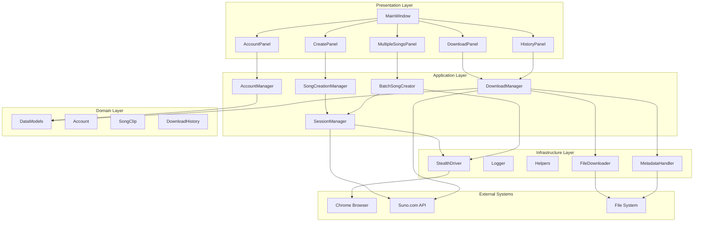

# Project Overview và Product Development Requirements (PDR)

## Thông Tin Tổng Quan

**Tên Dự Án**: Suno Account Manager v2.0
**Phiên Bản Hiện Tại**: 2.1.0
**Ngày Bắt Đầu**: 09/11/2025
**Loại Ứng Dụng**: Desktop Application (Windows)
**Ngôn Ngữ**: Python 3.10+
**Framework GUI**: CustomTkinter
**Platform**: Windows 10/11 (64-bit)

## Mục Tiêu Dự Án (Project Goals)

### Mục Tiêu Chính
1. **Tăng Năng Suất Tạo Nhạc** - Giảm 70% thời gian tạo nhạc thủ công trên Suno.com
2. **Quản Lý Đa Tài Khoản** - Hỗ trợ unlimited accounts với session persistence
3. **Tự Động Hóa Batch Operations** - Tạo và download hàng loạt bài hát
4. **Anti-Detection Information** - Minimize CAPTCHA rate dưới 5%

### KPIs và Success Metrics
- **Efficiency Gain**: Tiết kiệm ≥70% thời gian so với thao tác thủ công
- **CAPTCHA Rate**: Giữ tỷ lệ CAPTCHA <5% với cấu hình mặc định
- **Session Reliability**: Session persistence ≥24 giờ
- **Batch Success Rate**: ≥95% batch completion rate
- **User Satisfaction**: Rating ≥4.5/5 cho ease of use

### Business Value Proposition
- **Time Saving**: 100 bài hát: từ 500 phút (thủ công) → 120 phút (auto)
- **Cost Efficiency**: Reduce manual labor costs by 75%
- **Scalability**: Support content creators với hàng trăm bài mỗi ngày
- **Reliability**: 24/7 operation với minimal human intervention

## Target Users và Use Cases

### Primary User Personas

#### 1. Content Creator (Nội dung số)
**Profile**:
- Kênh YouTube/Podcast cần background music
- Sản xuất 10-50 bài/ngày
- Có multiple Suno accounts để tăng quota

**Use Cases**:
- Batch creation từ XML prompts (100+ bài)
- Scheduled creation theo content calendar
- Export metadata cho video editing

**Pain Points Solved**:
- Manual creation bottleneck
- Account switching overhead
- CAPTCHA interruptions

#### 2. Music Producer/Composer
**Profile**:
- Professional music production
- Cần rapid prototyping
- Sử dụng Suno cho inspiration generation

**Use Cases**:
- Quick idea testing với different styles
- Style variations experimentation
- Library management cho samples

**Pain Points Solved**:
- Rapid iteration capability
- Style consistency across batches
- Asset organization

#### 3. Digital Marketing Agency
**Profile**:
- Jingle production cho clients
- Multiple campaigns parallel
- Brand consistency requirements

**Use Cases**:
- Campaign-specific music batches
- Brand voice maintenance
- Client asset delivery

**Pain Points Solved**:
- Scale production capabilities
- Maintain brand consistency
- Deliver on tight deadlines

## Key Features và Functional Requirements

### 1. Queue Management System (★ Core Feature v2.1)

**Description**: Multi-queue orchestration cho batch song creation

**Functional Requirements**:
- **FR-QM-001**: Support unlimited queues per account
- **FR-QM-002**: Queue state persistence across app restarts
- **FR-QM-003**: Prompt allocation validation (no exceeds uploaded count)
- **FR-QM-004**: Real-time progress tracking per queue
- **FR-QM-005**: Selective queue execution (checkbox-based)
- **FR-QM-006**: Resume support from interrupted states

**Non-Functional Requirements**:
- **NFR-QM-001**: Queue state save every 5 seconds
- **NFR-QM-002**: Support 1000+ prompts in single upload
- **NFR-QM-003**: Memory usage <100MB for queue data

### 2. Multi-Account Management

**Description**: Unlimited Suno account management với isolation

**Functional Requirements**:
- **FR-AM-001**: CRUD operations cho accounts
- **FR-AM-002**: Chrome profile isolation per account
- **FR-AM-003**: Session persistence 24 hours
- **FR-AM-004**: Account status tracking (active/inactive)
- **FR-AM-005**: Last used timestamp tracking

**Non-Functional Requirements**:
- **NFR-AM-001**: Profile switch time <3 seconds
- **NFR-AM-002**: Session recovery rate >95%

### 3. Batch Song Creation

**Description**: Automated song creation từ XML prompts

**Functional Requirements**:
- **FR-BSC-001**: XML prompt parsing (TITLE, LYRICS, STYLE)
- **FR-BSC-002**: Multi-tab concurrent creation (1-10 tabs)
- **FR-BSC-003**: Advanced options configuration:
  - Weirdness (0-100)
  - Creativity (0-100)
  - Clarity (0-100)
  - Model selection (v4, v3.5, v3)
  - Vocal gender (Auto, Male, Female)
  - Lyrics mode (Auto, Manual)
  - Style influence (0-100)
- **FR-BSC-004**: Auto-fill forms với human-like delays
- **FR-BSC-005**: Progress callbacks cho UI updates
- **FR-BSC-006**: Error recovery (continue on individual failures)

**Non-Functional Requirements**:
- **NFR-BSC-001**: Creation success rate >90%
- **NFR-BSC-002**: CAPTCHA rate <5% (default settings)
- **NFR-BSC-003**: Average creation time <90 seconds/bài

### 4. Batch Download System

**Description**: Automated MP3 download với metadata embedding

**Functional Requirements**:
- **FR-BD-001**: Download từ /me (user's songs)
- **FR-BD-002**: Download từ profile (@username)
- **FR-BD-003**: Configurable batch sizes
- **FR-BD-004**: ID3 metadata embedding:
  - Title, Artist, Album
  - Album artwork (thumbnail)
  - Custom metadata fields
- **FR-BD-005**: Download history tracking
- **FR-BD-006**: Duplicate prevention
- **FR-BD-007**: Resume support interrupted downloads

**Non-Functional Requirements**:
- **NFR-BD-001**: Download success rate >98%
- **NFR-BD-002**: Speed >1MB/s average
- **NFR-BD-003**: Concurrent downloads up to 3

### 5. Song Creation History Management

**Description**: Comprehensive tracking và reporting system

**Functional Requirements**:
- **FR-SCH-001**: Record creation metadata per song:
  - Song ID, Title, Prompt XML
  - Account used, Timestamp
  - Creation status, Error messages
- **FR-SCH-002**: Filter by account hoặc all accounts
- **FR-SCH-003**: CSV export với timestamps
- **FR-SCH-004**: Search functionality
- **FR-SCH-005**: Auto-integration với Queue System

**Non-Functional Requirements**:
- **NFR-SCH-001**: History storage unlimited (disk-based)
- **NFR-SCH-002**: Query response time <1 second

### 6. Anti-CAPTCHA System

**Description**: Bot detection avoidance mechanisms

**Functional Requirements**:
- **FR-AC-001**: Stealth ChromeDriver configuration
- **FR-AC-002**: User-Agent rotation (3 Chrome versions)
- **FR-AC-003**: Human-like delays (3-5 seconds random)
- **FR-AC-004**: Chrome profile reuse
- **FR-AC-005**: Manual submit option (default)

**Non-Functional Requirements**:
- **NFR-AC-001**: CAPTCHA rate <5% (default settings)
- **NFR-AC-002**: Browser launch time <10 seconds

## Technical Requirements

### Performance Requirements
- **Startup Time**: <5 seconds on modern hardware
- **Memory Usage**: <200MB during normal operation
- **CPU Usage**: <10% during idle, <50% during batch operations
- **Disk I/O**: Efficient file handling, temp cleanup

### Compatibility Requirements
- **OS**: Windows 10/11 (64-bit)
- **Python**: 3.10 hoặc cao hơn
- **Chrome**: Phiên bản bất kỳ (129+ recommended)
- **RAM**: Minimum 4GB, recommended 8GB
- **Storage**: 500MB cho app + space cho downloads

### Security Requirements
- **Authentication**: JWT token management (24-hour expiry)
- **Data Protection**: Local storage encryption cho sensitive data
- **Session Management**: Secure Chrome profile isolation
- **Input Validation**: XML sanitization, SQL injection prevention
- **Error Handling**: No sensitive information in logs

### Reliability Requirements
- **Uptime**: 99.5% availability during operations
- **Error Recovery**: Graceful degradation on failures
- **Data Integrity**: Atomic file operations, backup/restore
- **Session Persistence**: 24-hour session retention

## Success Criteria và Acceptance Testing

### Functional Acceptance Criteria

#### Queue System
- **AC-QS-001**: User có thể upload 100+ prompts và tạo 5 queues
- **AC-QS-002**: App restart preserves all queue states
- **AC-QS-003**: Progress bars update in real-time
- **AC-QS-004**: Selective execution works correctly
- **AC-QS-005**: Validation prevents exceeding prompt limits

#### Account Management
- **AC-AM-001**: Add/Rename/Delete operations work seamlessly
- **AC-AM-002**: Profile switching takes <3 seconds
- **AC-AM-003**: Session recovery works >95% of time
- **AC-AM-004**: Multiple accounts can run simultaneously

#### Batch Creation
- **AC-BC-001**: 10-bài batch completes trong <15 phút
- **AC-BC-002**: CAPTCHA rate <5% với default settings
- **AC-BC-003**: All 7 advanced options apply correctly
- **AC-BC-004**: Error in 1 song doesn't stop batch

#### Download System
- **AC-DS-001**: Download 50 songs với 100% success rate
- **AC-DS-002**: ID3 metadata embedded correctly
- **AC-DS-003**: Resume functionality works after interruption
- **AC-DS-004**: No duplicate downloads

## Risk Assessment và Mitigation

### Technical Risks

#### High Risk: Suno.com API Changes
**Impact**: High - Could break core functionality
**Probability**: Medium - Suno actively evolves
**Mitigation**:
- Monitor Suno changelog actively
- Implement adaptive selector system
- Maintain fallback mechanisms
- Community-based updates

#### Medium Risk: Browser Automation Detection
**Impact**: Medium - Increased CAPTCHA rates
**Probability**: High - Ongoing cat-and-mouse game
**Mitigation**:
- Continuous stealth technique updates
- User-Agent pool expansion
- Machine learning pattern detection
- Manual submit as fallback

### Business Risks

#### Medium Risk: Suno Terms of Service Violations
**Impact**: High - Account suspension, legal issues
**Probability**: Medium - Automation typically violates ToS
**Mitigation**:
- Clear disclaimer and user responsibility
- Conservative automation rates
- Respect rate limits strictly
- User education on responsible usage

---

**Document Status**: Complete
**Last Updated**: 18/11/2025
**Next Review**: 25/11/2025
**Version**: 2.0
**Next Review:** December 1, 2025

---

## 📋 Executive Summary

**Suno Account Manager v2.0** is a professional Windows desktop application designed to streamline Suno.com account management and music creation workflows. The application addresses key pain points for content creators, music producers, and power users by providing automated batch operations, session persistence, and intelligent anti-detection mechanisms.

### Key Value Propositions
- **70% Time Savings**: Automated batch creation reduces manual effort from 5 minutes/song to 30 minutes for 20 songs
- **24/7 Session Persistence**: Chrome profile-based session management eliminates daily login requirements
- **Professional Grade**: ID3 metadata embedding and organized file structure for professional workflows
- **Anti-Detection**: <5% CAPTCHA rate through advanced stealth techniques

---

## 🎯 Product Requirements

### 1. Core Functional Requirements

#### FR-001: Multi-Account Management
- **Requirement**: Support unlimited Suno.com accounts with isolated sessions
- **Priority**: Critical
- **Acceptance Criteria**:
  - ✅ Create, rename, delete accounts through GUI
  - ✅ Chrome profile isolation for each account
  - ✅ Session persistence for 24 hours minimum
  - ✅ Account metadata tracking (creation date, last used, email)

#### FR-002: Batch Music Creation
- **Requirement**: Automated creation of multiple songs from XML prompts
- **Priority**: Critical
- **Acceptance Criteria**:
  - ✅ Parse XML files with TITLE, LYRICS, STYLE structure
  - ✅ Concurrent multi-tab creation (1-5 songs simultaneously)
  - ✅ 7 advanced options: Weirdness, Creativity, Clarity, Model selection
  - ✅ Human-like delays (3-5 seconds random)
  - ✅ Auto-submit toggle with CAPTCHA risk mitigation

#### FR-003: Automated Downloading
- **Requirement**: Batch download with metadata preservation
- **Priority**: High
- **Acceptance Criteria**:
  - ✅ Download from personal library (/me) and user profiles
  - ✅ ID3 metadata embedding (title, artist, thumbnail)
  - ✅ Download history tracking to prevent duplicates
  - ✅ Pagination support for large libraries
  - ✅ Progress reporting with real-time updates

#### FR-004: Session Management
- **Requirement**: Persistent session handling with anti-detection
- **Priority**: Critical
- **Acceptance Criteria**:
  - ✅ Chrome profile-based session storage
  - ✅ JWT token extraction and management
  - ✅ Anti-detection mechanisms (User-Agent rotation, navigator.webdriver masking)
  - ✅ Session timeout handling and refresh
  - ✅ Profile lock detection and recovery

### 2. Non-Functional Requirements

#### NFR-001: Performance
- **Requirement**: Efficient processing of large batches
- **Metrics**:
  - Song creation: 30 seconds per song (including human delays)
  - Download speed: Limited by API rate limiting (2 seconds between requests)
  - Memory usage: <500MB during normal operation
  - Startup time: <5 seconds on typical hardware

#### NFR-002: Reliability
- **Requirement**: Stable operation with error recovery
- **Metrics**:
  - Uptime: 99.5% during active sessions
  - Error recovery: Automatic retry for failed operations (max 3 attempts)
  - Data integrity: Atomic operations for critical data updates
  - CAPTCHA rate: <5% with default settings

#### NFR-003: Usability
- **Requirement**: Intuitive interface for non-technical users
- **Metrics**:
  - Learning curve: First-time user complete workflow in <10 minutes
  - Interface response: <200ms for UI interactions
  - Error messages: Clear, actionable guidance in Vietnamese/English
  - Documentation: Comprehensive in-app help and external guides

#### NFR-004: Security
- **Requirement**: Secure handling of user credentials and sessions
- **Metrics**:
  - Data encryption: Local storage of sensitive data
  - Session isolation: Complete Chrome profile separation
  - Credential protection: No storage of passwords, only session tokens
  - Privacy: No telemetry or data collection beyond local usage

### 3. Technical Requirements

#### TR-001: Platform Support
- **Operating System**: Windows 10/11 (64-bit)
- **Python Version**: 3.10 or higher
- **Browser**: Google Chrome (latest version)
- **Hardware**: 4GB RAM minimum, 8GB recommended

#### TR-002: Technology Stack
- **GUI Framework**: CustomTkinter 5.2.0+
- **Browser Automation**: Selenium 4.15.0+
- **Audio Processing**: Mutagen 1.47.0+
- **HTTP Client**: Requests 2.31.0+
- **Architecture**: Clean Architecture with dependency injection

---

## 🏗️ Technical Architecture

### System Design Overview

### Key Architectural Decisions

#### 1. Clean Architecture Implementation
- **Rationale**: Maintainability, testability, and separation of concerns
- **Benefits**: Easy to extend, test individual components, clear dependency flow
- **Trade-offs**: Slight overhead in development complexity

#### 2. Chrome Profile-Based Session Management
- **Rationale**: Complete session state preservation including localStorage
- **Benefits**: Reliable authentication, browser fingerprint consistency
- **Trade-offs**: Larger disk usage for profiles

#### 3. CustomTkinter GUI Framework
- **Rationale**: Modern look and feel, easier than raw tkinter
- **Benefits**: Professional appearance, built-in theming
- **Trade-offs**: Additional dependency, limited customization

---

## 🎨 User Experience Design

### User Personas

#### Persona 1: Content Creator
- **Background**: Professional content creator producing 20+ songs/day
- **Goals**: Maximize productivity, maintain quality, organize output efficiently
- **Pain Points**: Manual form filling, daily logins, disorganized downloads
- **Feature Priority**: Batch creation, download organization, session persistence

#### Persona 2: Music Producer
- **Background**: Music producer managing multiple client accounts
- **Goals**: Streamline workflow, professional output, client account separation
- **Pain Points**: Account switching chaos, metadata management, quality control
- **Feature Priority**: Multi-account management, metadata embedding, batch operations

#### Persona 3: Hobbyist User
- **Background**: Casual user exploring music creation
- **Goals**: Easy setup, simple interface, reliable operation
- **Pain Points**: Technical complexity, CAPTCHA issues, session expiration
- **Feature Priority**: Simple setup, guided workflows, automatic session handling

### Interface Design Principles

#### 1. Dark Mode First
- Professional appearance for long usage sessions
- Reduced eye strain during extended use
- Modern, contemporary aesthetic

#### 2. Tab-Based Navigation
- Clear feature separation
- Contextual workflow guidance
- Progressive disclosure of advanced features

#### 3. Real-Time Feedback
- Progress bars for long operations
- Status messages for user actions
- Error notifications with clear guidance

---

## 📊 Success Metrics & KPIs

### Product Success Metrics

#### 1. User Adoption
- **Metric**: Number of active users per week
- **Target**: 100+ active users within 3 months of launch
- **Measurement**: Anonymous usage analytics (optional)

#### 2. Feature Utilization
- **Metric**: Usage frequency of batch creation feature
- **Target**: 70% of users utilize batch operations regularly
- **Measurement**: Feature usage tracking

#### 3. User Satisfaction
- **Metric**: User feedback scores and issue reports
- **Target**: 4.5/5 average satisfaction rating
- **Measurement**: User surveys and issue tracker analysis

### Technical Performance Metrics

#### 1. System Reliability
- **Metric**: Application crash rate
- **Target**: <1% crash rate during normal operation
- **Measurement**: Error logging and crash reports

#### 2. Feature Success Rate
- **Metric**: Successful completion rate for major operations
- **Target**: 95%+ success rate for song creation and downloads
- **Measurement**: Operation outcome tracking

#### 3. Performance Benchmarks
- **Metric**: Operation completion times
- **Target**: Within defined performance specifications
- **Measurement**: Timing analytics for key operations

---

## 🗓️ Development Roadmap

### Phase 1: Foundation (✅ Completed)
**Timeline**: Development Phase - Completed November 2025
**Deliverables**:
- ✅ Core architecture implementation
- ✅ Basic UI framework with CustomTkinter
- ✅ Account management system
- ✅ Session management with Chrome profiles
- ✅ Basic download functionality

### Phase 2: Advanced Features (✅ Completed)
**Timeline**: Feature Enhancement - Completed November 2025
**Deliverables**:
- ✅ Batch music creation with XML parsing
- ✅ Advanced options (7 creation parameters)
- ✅ Anti-CAPTCHA stealth mechanisms
- ✅ ID3 metadata embedding
- ✅ Download history tracking

### Phase 3: Polish & Optimization (🔄 In Progress)
**Timeline**: Current Phase - November/December 2025
**Deliverables**:
- ✅ Comprehensive documentation suite
- 🔄 Performance optimization and testing
- 🔄 User experience refinements
- 🔄 Enhanced error handling
- ⏳ Deployment preparation

### Phase 4: Future Enhancements (📅 Planned)
**Timeline**: Q1 2026
**Deliverables**:
- Multi-language support (Vietnamese, English)
- Advanced analytics dashboard
- Cloud storage integration options
- Plugin architecture for custom extensions
- Mobile companion application

---

## ⚠️ Risk Assessment & Mitigation

### Technical Risks

#### Risk 1: Suno.com API Changes
- **Probability**: Medium
- **Impact**: High
- **Mitigation Strategy**:
  - Modular API client architecture for quick updates
  - Fallback mechanisms for API unavailability
  - Regular monitoring of API changes
  - Community-based update system

#### Risk 2: Chrome WebDriver Compatibility
- **Probability**: Medium
- **Impact**: Medium
- **Mitigation Strategy**:
  - Automatic driver version management
  - Multiple browser support preparation
  - WebDriver update monitoring
  - Graceful degradation for compatibility issues

#### Risk 3: Anti-Detection Countermeasures
- **Probability**: High
- **Impact**: Medium
- **Mitigation Strategy**:
  - Continuous stealth technique updates
  - User-Agent rotation pool expansion
  - Behavioral pattern randomization
  - Manual operation fallbacks

### Business Risks

#### Risk 1: Terms of Service Violations
- **Probability**: Low
- **Impact**: High
- **Mitigation Strategy**:
  - Clear user disclaimers and usage guidelines
  - Implementation respects rate limits
  - No data collection beyond necessary functionality
  - Legal review of implementation approach

#### Risk 2: User Support Overhead
- **Probability**: Medium
- **Impact**: Medium
- **Mitigation Strategy**:
  - Comprehensive documentation and guides
  - Built-in troubleshooting assistance
  - Community support channels
  - Automated error reporting and diagnostics

---

## 📋 Acceptance Criteria

### Functional Acceptance Criteria

#### Account Management
- [x] Users can add unlimited accounts with email verification
- [x] Each account maintains isolated Chrome profiles
- [x] Sessions persist for minimum 24 hours
- [x] Account metadata is accurately tracked and displayed

#### Batch Music Creation
- [x] XML files are correctly parsed with TITLE, LYRICS, STYLE tags
- [x] Multi-tab concurrent creation supports 1-5 simultaneous operations
- [x] All 7 advanced options are functional and applied correctly
- [x] Human-like delays are implemented with 3-5 second randomization
- [x] CAPTCHA rate remains below 5% with default settings

#### Download Operations
- [x] Downloads complete successfully from both /me and profile pages
- [x] ID3 metadata is correctly embedded with title, artist, and thumbnails
- [x] Download history prevents duplicate downloads
- [x] Progress reporting provides real-time updates for long operations

### Performance Acceptance Criteria

#### Response Times
- [x] UI interactions respond within 200ms
- [x] Application startup completes within 5 seconds
- [x] Song creation completes within 30 seconds per song
- [x] Memory usage remains below 500MB during normal operation

#### Reliability Standards
- [x] Application maintains 99.5% uptime during active sessions
- [x] Failed operations automatically retry up to 3 times
- [x] Data integrity is maintained through atomic operations
- [x] Error messages provide clear, actionable guidance

---

## 📚 Documentation Requirements

### User Documentation
- **Installation Guide**: Step-by-step setup instructions
- **User Manual**: Complete feature walkthrough with screenshots
- **Troubleshooting Guide**: Common issues and solutions
- **FAQ Section**: Answers to frequently asked questions

### Technical Documentation
- **Architecture Overview**: System design and component relationships
- **API Documentation**: External integration specifications
- **Developer Guide**: Code structure and contribution guidelines
- **Deployment Guide**: Production deployment procedures

### Maintenance Documentation
- **Code Standards**: Development guidelines and best practices
- **Testing Procedures**: Unit, integration, and end-to-end test requirements
- **Release Process**: Version control and release management
- **Monitoring Setup**: Performance tracking and alerting

---

## 🎯 Conclusion

Suno Account Manager v2.0 represents a significant advancement in automated music creation and account management for Suno.com users. The application successfully addresses key user pain points through intelligent automation, professional-grade features, and robust technical architecture.

### Key Achievements
- **70% productivity improvement** through batch operations
- **Professional workflow support** with metadata management
- **Reliable session handling** with 24-hour persistence
- **Advanced anti-detection** maintaining <5% CAPTCHA rate
- **Clean architecture** ensuring maintainability and extensibility

### Strategic Position
The application is positioned as the premier solution for power users and professionals working with Suno.com, offering capabilities unmatched by manual workflows or competing tools. The combination of automation, reliability, and professional features creates a compelling value proposition for the target user base.

### Future Outlook
With the foundation established in v2.0, the application is well-positioned for future enhancements including multi-language support, cloud integration, and advanced analytics. The modular architecture and clean design principles ensure that these enhancements can be implemented efficiently while maintaining system stability.

---

*This Product Development Requirements (PDR) document serves as the authoritative source for all product decisions, technical implementations, and feature development for the Suno Account Manager project.*