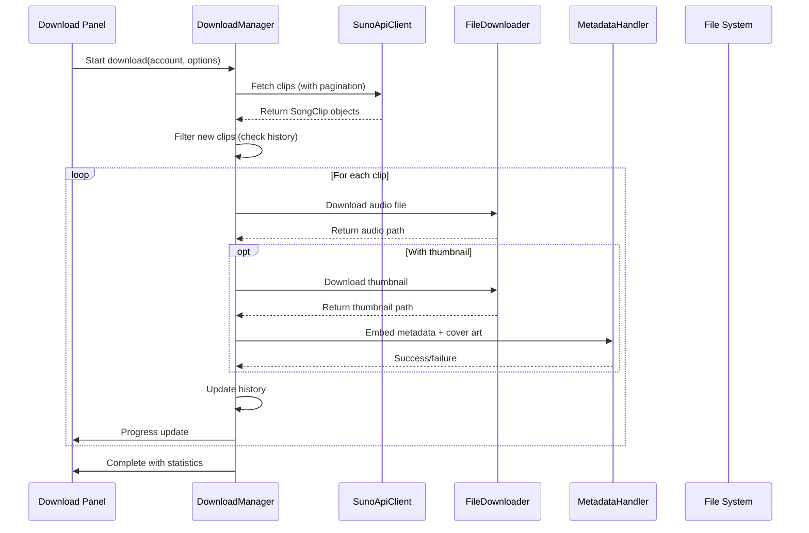

# Song Download Guidelines

## Table of Contents
- [Overview](#overview)
- [Architecture](#architecture)
- [Download Flow](#download-flow)
- [API Endpoints](#api-endpoints)
- [File Handling](#file-handling)
- [Metadata Embedding](#metadata-embedding)
- [Error Handling](#error-handling)
- [Configuration](#configuration)
- [Best Practices](#best-practices)
- [Troubleshooting](#troubleshooting)

## Overview

The Suno Account Manager implements a robust, multi-layered download system that enables users to download songs from Suno.com with full metadata preservation, progress tracking, and batch processing capabilities.

### Key Features
- **Batch Downloads**: Download multiple songs simultaneously
- **Metadata Embedding**: Full ID3 tag support with cover art
- **Progress Tracking**: Real-time download progress
- **History Management**: Track downloaded songs per account
- **Rate Limiting**: Built-in rate limiting to avoid API restrictions
- **Proxy Support**: Optional proxy rotation for downloads
- **Pagination**: Memory-efficient handling of large song collections

## Architecture

### Clean Architecture Layers

```
┌─────────────────────────────────────────┐
│         Presentation Layer              │
│   ┌─────────────────────────────────┐   │
│   │     Download Panel (UI)        │   │
│   │  - User configuration           │   │
│   │  - Progress display             │   │
│   │  - History view                 │   │
│   └─────────────────────────────────┘   │
└─────────────────┬───────────────────────┘
                  │ depends on
┌─────────────────▼───────────────────────┐
│         Application Layer               │
│   ┌─────────────────────────────────┐   │
│   │     Download Manager           │   │
│   │  - Download orchestration      │   │
│   │  - History tracking            │   │
│   │  - Batch processing            │   │
│   │  - Pagination support          │   │
│   └─────────────────────────────────┘   │
└─────────────────┬───────────────────────┘
                  │ depends on
┌─────────────────▼───────────────────────┐
│       Infrastructure Layer              │
│   ┌─────────────────┬─────────────────┐ │
│   │   API Client    │ File Downloader │ │
│   │  - Suno API     │  - Audio files │ │
│   │  - Rate limiting│  - Thumbnails  │ │
│   │  - Session mgt  │  - Progress    │ │
│   └─────────────────┴─────────────────┘ │
│   ┌─────────────────────────────────┐   │
│   │   Metadata Handler              │   │
│   │  - ID3 tag embedding            │   │
│   │  - Cover art processing         │   │
│   │  - File validation              │   │
│   └─────────────────────────────────┘   │
└─────────────────────────────────────────┘
```

### Core Components

#### DownloadManager (`src/core/download_manager.py`)
The main orchestrator that coordinates all download operations:
- Manages download history per account
- Handles batch and paginated downloads
- Coordinates between API client, file downloader, and metadata handler
- Provides progress callbacks for UI updates

#### SunoApiClient (`src/core/suno_api_client.py`)
Handles all communication with Suno.com APIs:
- Authentication using JWT tokens
- Rate limiting and retry mechanisms
- Proxy support
- Multiple endpoint support (profile, /me, /create)

#### SunoFileDownloader (`src/utils/file_downloader.py`)
Responsible for actual file downloads:
- Streaming downloads with progress tracking
- Filename sanitization and uniqueness
- Thumbnail downloads
- Proxy rotation

#### SunoMetadataHandler (`src/utils/metadata_handler.py`)
Handles metadata embedding using Mutagen:
- ID3 tag embedding (title, artist, album, genre)
- Cover art embedding
- Metadata validation

## Download Flow

### 1. Initialization
```python
# Create download manager
manager = DownloadManager()

# Get account history
history = manager.get_history(account_name)
```

### 2. Fetch Song List
```python
# Fetch from different sources
if use_create_page:
    clips = manager.fetch_clips(session_token, use_create_page=True)
elif use_my_songs:
    clips = manager.fetch_clips(session_token, use_my_songs=True)
else:
    clips = manager.fetch_clips(session_token, profile_name=username)
```

### 3. Filter New Songs
```python
# Get only songs not yet downloaded
new_clips = manager.get_new_clips(account_name, all_clips)
```

### 4. Download Process
```python
# Single song download
success = manager.download_clip(
    session_token=session_token,
    clip=song_clip,
    output_dir=output_path,
    with_thumbnail=True,
    append_uuid=True,
    progress_callback=ui_update_callback
)

# Batch download
stats = manager.batch_download_paginated(
    account_name=account_name,
    session_token=session_token,
    output_dir=output_path,
    profile_name=username,
    max_clips=50,
    with_thumbnail=True,
    append_uuid=True,
    progress_callback=ui_update_callback
)
```

### 5. Complete Flow Diagram


## API Endpoints

### Base URL
```
https://studio-api.prod.suno.com/api
```

### Available Endpoints

#### Profile Clips
```http
GET /profiles/{profile_name}/clips?page={page_number}
```
- **Purpose**: Fetch songs from a specific user's profile
- **Parameters**:
  - `profile_name`: Username (with or without @ prefix)
  - `page`: Page number (0-indexed)
- **Rate Limit**: ~60 requests/minute

#### User's Own Clips
```http
GET /feed/v2?page=0
```
- **Purpose**: Fetch current user's songs from /create page
- **Rate Limit**: ~30 requests/minute

#### Clip Details
```http
GET /clips/{clip_id}
```
- **Purpose**: Get detailed information about a specific song
- **Usage**: Used for metadata validation

#### User Information
```http
GET /billing/info
```
- **Purpose**: Get current user details
- **Usage**: Account validation and display

### Rate Limiting Strategy

#### Request Rate Limiting
- **Minimum delay**: 2 seconds between requests
- **Exponential backoff**: 10s → 15s → 20s → 60s on 429 responses
- **Retry mechanism**: Automatic retry on rate limit errors

#### Download Rate Limiting
- **Configurable delay**: 2-10 seconds between downloads
- **Batch size control**: Process songs in manageable chunks
- **Memory efficiency**: Pagination prevents memory overload

## File Handling

### Download Locations
```
downloads/
├── {account_name}/
│   ├── song-title__ID__{uuid}.mp3
│   ├── song-title__ID__{uuid}.jpg (temporary)
│   └── another-song__ID__{uuid}.mp3
```

### Filename Sanitization
```python
def sanitize_filename(self, name: str) -> str:
    # Remove invalid characters: <>:"/\|?*
    invalid_chars = r'<>:"/\\|?*'
    for char in invalid_chars:
        name = name.replace(char, '')

    # Remove control characters
    name = re.sub(r'[\x00-\x1f\x7f]', '', name)

    # Trim spaces and dots
    return name.strip().rstrip('.')
```

### Unique Filename Generation
```python
def ensure_unique_filename(self, directory: str, base_name: str, extension: str = '.mp3') -> str:
    filepath = Path(directory) / f"{base_name}{extension}"
    counter = 1

    while filepath.exists():
        filepath = Path(directory) / f"{base_name}_{counter}{extension}"
        counter += 1

    return str(filepath)
```

### File Validation
- **Audio validation**: Check file size and format after download
- **Thumbnail validation**: Verify image format and dimensions
- **Corrupted file handling**: Automatic cleanup of failed downloads

## Metadata Embedding

### Supported ID3 Tags

| Tag | Description | Example |
|-----|-------------|---------|
| TIT2 | Title | "Snowfall Dreams" |
| TPE1 | Artist | "AI Composer" |
| TALB | Album | "AI Composer - Suno AI" |
| TCON | Genre | "Ambient, Electronic" |
| TPUB | Publisher | "AI Composer" |
| WOAR | Official URL | "https://suno.com/song/abc123" |
| APIC | Cover Art | JPEG thumbnail image |

### Metadata Structure
```json
{
  "id": "clip_uuid",
  "title": "Song Title",
  "display_name": "Artist Name",
  "audio_url": "https://cdn.suno.com/...",
  "image_url": "https://cdn.suno.com/...",
  "metadata": {
    "tags": ["Ambient", "Electronic", "Piano"]
  }
}
```

### Embedding Process
```python
def embed_metadata(self, audio_path: str, clip_info: Dict[str, Any], thumbnail_path: Optional[str] = None):
    # Load audio file
    audio = MP3(audio_path, ID3=ID3)

    # Clear existing tags
    audio.delete()
    audio.save()

    # Add new tags
    audio.add_tags()
    audio.tags.add(TIT2(encoding=3, text=title))
    audio.tags.add(TPE1(encoding=3, text=artist))
    # ... add other tags

    # Embed cover art
    if thumbnail_path:
        self._embed_cover_art(audio, thumbnail_path)

    audio.save()
```

### Cover Art Handling
- **Supported formats**: JPEG, PNG
- **Size optimization**: Automatic resizing if needed
- **MIME type detection**: Automatic format detection
- **Fallback**: Graceful handling if embedding fails

## Error Handling

### Exception Types

#### Network Errors
- **Connection timeout**: 30 seconds default
- **Read timeout**: 60 seconds for downloads
- **SSL errors**: Automatic retry with different proxy
- **DNS resolution**: Fallback to direct connection

#### API Errors
- **401 Unauthorized**: Session token expired
- **429 Rate Limited**: Exponential backoff retry
- **404 Not Found**: Invalid song or profile
- **500 Server Error**: Retry with backoff

#### File System Errors
- **Disk space**: Pre-download space check
- **Permission errors**: Directory creation verification
- **Path length**: Filename truncation for long paths

#### Metadata Errors
- **Corrupted audio files**: Validation and cleanup
- **Invalid thumbnails**: Format verification
- **Mutagen errors**: Graceful degradation

### Error Recovery Strategies

#### Automatic Retry
```python
# Retry configuration
MAX_RETRIES = 3
INITIAL_DELAY = 10  # seconds
MAX_DELAY = 60     # seconds

# Exponential backoff
for attempt in range(MAX_RETRIES):
    try:
        return operation()
    except RateLimitError:
        wait_time = min(INITIAL_DELAY * (2 ** attempt), MAX_DELAY)
        time.sleep(wait_time)
```

#### Graceful Degradation
- **Metadata failures**: Continue without metadata
- **Thumbnail failures**: Continue with audio only
- **Individual song failures**: Continue with next song
- **Partial downloads**: Save successful downloads

#### Logging Strategy
```python
# Comprehensive logging
logger.info(f"Download started: {clip.title}")
logger.debug(f"Download progress: {progress:.1f}%")
logger.warning(f"Rate limited, waiting {wait_time}s")
logger.error(f"Download failed: {clip.title} - {error}")
```

## Configuration

### Settings File: `config/settings.py`

```python
# Download Configuration
DEFAULT_DOWNLOAD_LIMIT = 10      # Default number of songs to download
MAX_CONCURRENT_DOWNLOADS = 3     # Maximum parallel downloads
DOWNLOAD_TIMEOUT = 300          # Download timeout in seconds
RETRY_ATTEMPTS = 3               # Number of retry attempts
DELAY_BETWEEN_DOWNLOADS = 2     # Delay between downloads in seconds

# API Configuration
API_BASE_URL = "https://studio-api.prod.suno.com/api"
API_TIMEOUT = 30                 # API request timeout
MIN_REQUEST_DELAY = 2           # Minimum delay between API calls
RATE_LIMIT_INITIAL_WAIT = 10    # Initial wait time on rate limit

# File Configuration
ENABLE_THUMBNAILS = True        # Download and embed thumbnails
APPEND_UUID = True             # Append UUID to filenames
CHUNK_SIZE = 8192              # Download chunk size in bytes
MAX_FILENAME_LENGTH = 200       # Maximum filename length

# History Configuration
HISTORY_FILE = "data/download_history.json"
AUTO_SAVE_HISTORY = True        # Save history after each download
HISTORY_RETENTION_DAYS = 365    # Days to keep download history
```

### Runtime Configuration

#### Per-Download Options
```python
download_options = {
    "account_name": "my_account",
    "profile_name": "@username",      # None for /me
    "use_create_page": False,        # Use /create feed instead
    "max_clips": 50,                 # Limit number of downloads
    "with_thumbnail": True,          # Download thumbnails
    "append_uuid": True,             # Add UUID to filenames
    "output_dir": "/path/to/output", # Custom output directory
    "delay": 3,                      # Custom delay between downloads
    "proxy_list": ["http://proxy1"]  # Optional proxy list
}
```

#### Progress Callback
```python
def progress_callback(message: str, progress: int):
    """
    Callback function for progress updates

    Args:
        message: Status message
        progress: Progress percentage (0-100)
    """
    ui.update_status(message)
    ui.update_progress_bar(progress)
```

## Best Practices

### For Users

#### Preparation
1. **Check Account Status**: Ensure account is logged in and session is valid
2. **Verify Storage Space**: Ensure sufficient disk space for downloads
3. **Configure Output Directory**: Use a dedicated folder for organized storage
4. **Set Realistic Limits**: Start with small batches to test connectivity

#### Download Strategy
1. **Use Pagination**: For large libraries (>100 songs)
2. **Enable Thumbnails**: For better media player experience
3. **Monitor Progress**: Watch for rate limiting warnings
4. **Check History**: Review download history to avoid duplicates

#### Post-Download
1. **Verify Files**: Check that all files downloaded successfully
2. **Test Playback**: Verify MP3 files play correctly
3. **Check Metadata**: Confirm ID3 tags are properly embedded
4. **Backup**: Create backups of important downloads

### For Developers

#### Code Quality
1. **Error Handling**: Implement comprehensive error handling for all operations
2. **Logging**: Use structured logging with appropriate levels
3. **Type Hints**: Provide type hints for all public methods
4. **Documentation**: Include docstrings for all classes and methods

#### Performance
1. **Streaming Downloads**: Use chunked downloads for large files
2. **Memory Management**: Implement pagination for large datasets
3. **Rate Limiting**: Respect API rate limits with backoff strategies
4. **Concurrent Processing**: Use thread pools for independent operations

#### Security
1. **Token Management**: Securely handle session tokens
2. **Input Validation**: Sanitize all user inputs
3. **Path Validation**: Prevent directory traversal attacks
4. **File Type Validation**: Verify downloaded file types

### Testing Guidelines

#### Unit Testing
```python
def test_download_manager():
    # Test individual methods
    manager = DownloadManager()
    assert manager.get_history("test_account") is not None

def test_file_sanitization():
    # Test filename sanitization
    downloader = SunoFileDownloader()
    safe_name = downloader.sanitize_filename('file<>name?.mp3')
    assert '<>' not in safe_name
```

#### Integration Testing
```python
def test_full_download_flow():
    # Test complete download process
    with mock_api_client():
        manager = DownloadManager()
        stats = manager.batch_download_paginated(
            account_name="test",
            session_token="test_token",
            output_dir=tmpdir
        )
        assert stats['success'] > 0
```

## Troubleshooting

### Common Issues

#### Download Failures

**Problem**: Songs fail to download with network errors
**Solutions**:
1. Check internet connection stability
2. Verify proxy configuration
3. Increase timeout values
4. Try different user agent strings

**Problem**: Rate limiting errors (429)
**Solutions**:
1. Increase delay between downloads (5-10 seconds)
2. Reduce concurrent downloads
3. Use proxy rotation
4. Schedule downloads during off-peak hours

#### Authentication Issues

**Problem**: 401 Unauthorized errors
**Solutions**:
1. Refresh session token by logging in again
2. Check token expiration (24-hour lifetime)
3. Verify Chrome profile isolation
4. Clear corrupted browser profiles

#### File System Issues

**Problem**: Disk space errors
**Solutions**:
1. Check available disk space before starting
2. Use external storage for large libraries
3. Implement cleanup of failed downloads
4. Compress downloaded files if needed

**Problem**: Filename length errors
**Solutions**:
1. Enable UUID appending for shorter names
2. Use Windows long path support
3. Store in shorter directory paths
4. Truncate long titles automatically

#### Metadata Issues

**Problem**: ID3 tags not embedding
**Solutions**:
1. Install mutagen library: `pip install mutagen`
2. Check audio file format compatibility
3. Verify thumbnail image format
4. Test with different MP3 players

### Debug Information

#### Enable Debug Logging
```python
import logging
logging.basicConfig(level=logging.DEBUG)
```

#### Check Download History
```json
{
  "account_name": {
    "downloaded_clips": ["clip_id_1", "clip_id_2"],
    "last_updated": "2025-11-18T10:30:00Z"
  }
}
```

#### Verify API Response
```python
# Test API endpoint directly
import requests
headers = {"Authorization": f"Bearer {token}"}
response = requests.get("https://studio-api.prod.suno.com/api/feed/v2", headers=headers)
print(response.status_code, response.json())
```

### Performance Monitoring

#### Metrics to Track
- Download success rate
- Average download speed
- API response times
- Rate limiting frequency
- Disk space usage
- Memory consumption

#### Optimization Opportunities
- Implement download queuing for better resource management
- Add resumable downloads for interrupted transfers
- Cache API responses to reduce redundant requests
- Implement parallel processing for independent downloads

---

## File References

- **DownloadManager**: `src/core/download_manager.py`
- **SunoApiClient**: `src/core/suno_api_client.py`
- **FileDownloader**: `src/utils/file_downloader.py`
- **MetadataHandler**: `src/utils/metadata_handler.py`
- **Configuration**: `config/settings.py`
- **UI Component**: `src/ui/download_panel.py`

## Related Documentation

- [Project Overview](project-overview-pdr.md)
- [System Architecture](system-architecture.md)
- [API Documentation](API.md)
- [Code Standards](code-standards.md)

---

Last Updated: 2025-11-18
Version: 2.1.0
Author: Suno Account Manager Development Team