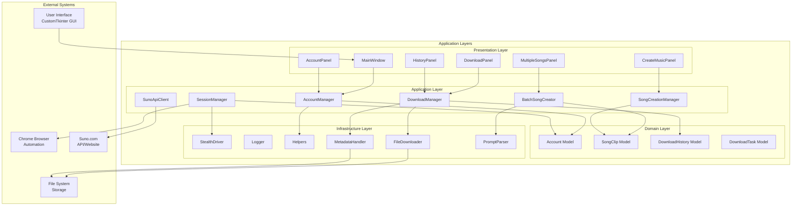
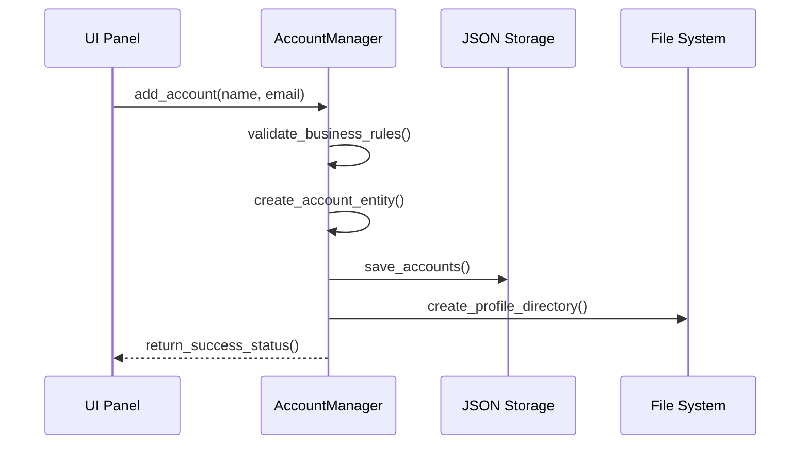
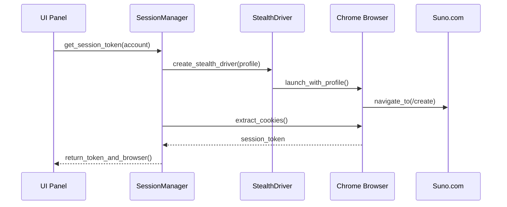
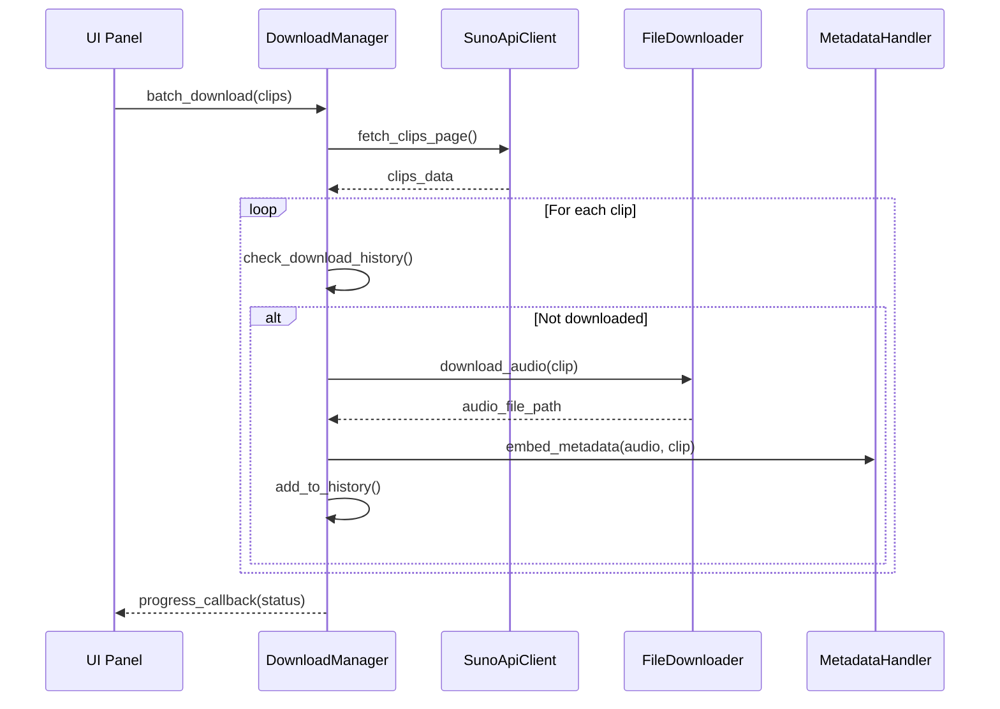
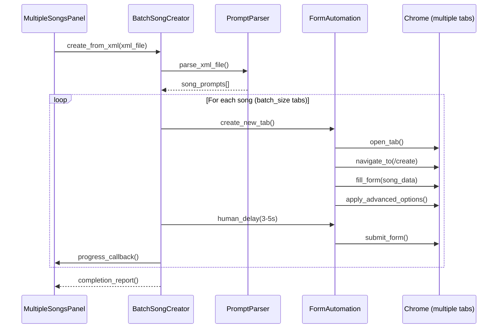
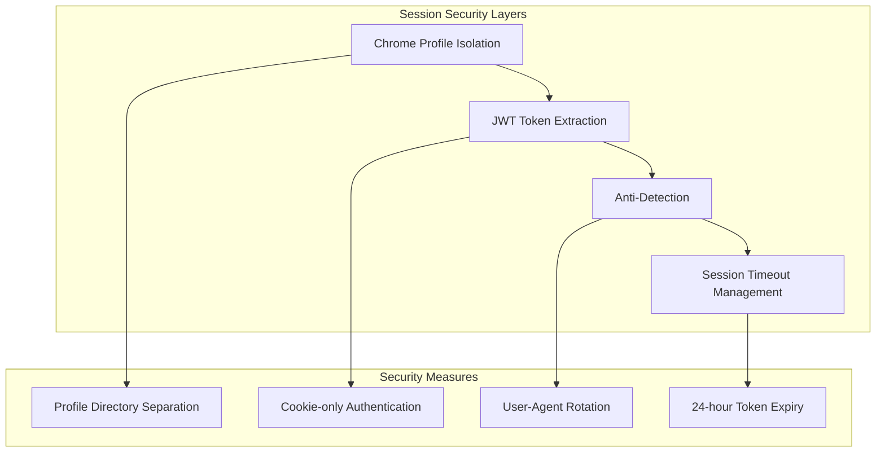
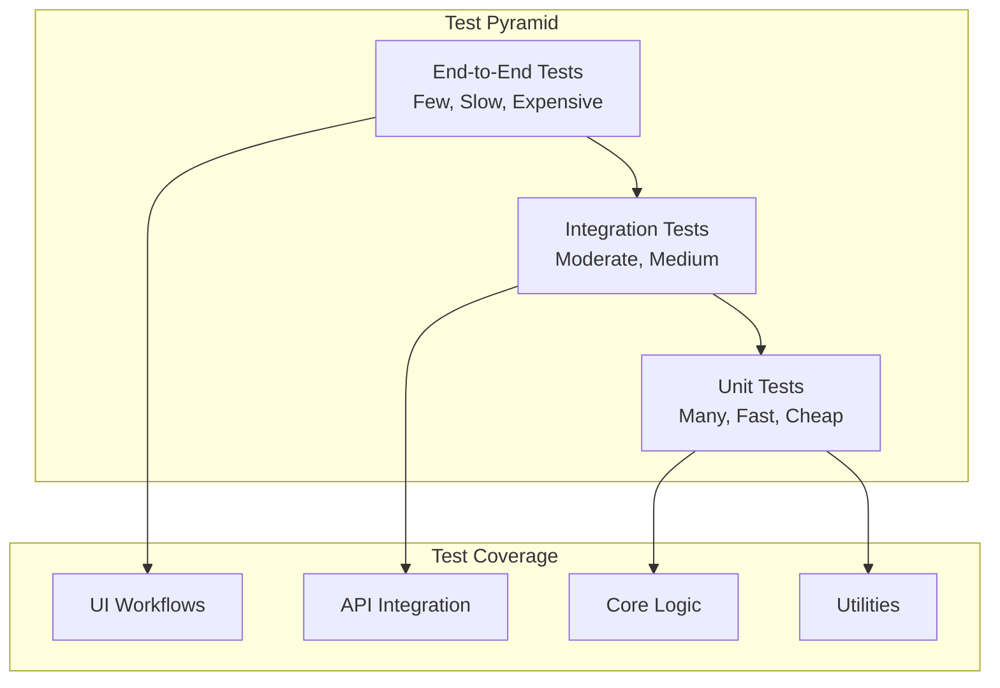

# System Architecture Documentation

**Phiên Bản:** 2.0
**Ngày Cập Nhật:** 18/11/2025
**Architecture Style:** Clean Architecture với Layer Separation

## Executive Summary

Suno Account Manager v2.0 được xây dựng theo Clean Architecture pattern với 4 layers rõ ràng: Presentation, Application, Domain, và Infrastructure. Architecture này đảm bảo tính maintainability, testability, và scalability cho ứng dụng desktop Windows quản lý tài khoản Suno.com.

## High-Level Architecture Overview

### Architecture Principles
1. **Separation of Concerns** - Mỗi layer có trách nhiệm rõ ràng
2. **Dependency Inversion** - High-level modules không phụ thuộc low-level modules
3. **Single Responsibility** - Mỗi class có một lý do để thay đổi
4. **Open/Closed** - Mở rộng cho functionality mới, đóng cho modification
5. **Interface Segregation** - Client-specific interfaces thay vì general-purpose

### C4 Model Visualization

#### Level 1: System Context
```
┌─────────────────────────────────────────────────────────────┐
│                    External Systems                        │
│  ┌─────────────┐  ┌─────────────┐  ┌─────────────────────┐  │
│  │  Suno.com   │  │   Chrome    │  │   Windows File      │  │
│  │  (Web App)  │  │   Browser   │  │      System         │  │
│  └─────────────┘  └─────────────┘  └─────────────────────┘  │
│         │                │                      │           │
│         └────────────────┼──────────────────────┘           │
│                          │                                 │
├─────────────────────────────────────────────────────────────┤
│                Suno Account Manager                        │
│                    (Desktop App)                           │
│  ┌─────────────────────────────────────────────────────┐    │
│  │              Windows Desktop                          │    │
│  │            Python Application                        │    │
│  └─────────────────────────────────────────────────────┘    │
└─────────────────────────────────────────────────────────────┘
```

#### Level 2: Container Diagram
```
┌─────────────────────────────────────────────────────────────┐
│                  Suno Account Manager                      │
├─────────────────────────────────────────────────────────────┤
│  ┌─────────────────┐  ┌─────────────────┐  ┌──────────────┐ │
│  │   UI Layer      │  │  Core Layer     │  │ Data Layer   │ │
│  │  (CustomTkinter)│  │ (Business Logic)│  │ (JSON Files) │ │
│  │                 │  │                 │  │              │ │
│  │ • MainWindow    │  │ • AccountMgr    │  │ • Accounts   │ │
│  │ • AccountPanel  │  │ • SessionMgr    │  │ • History    │ │
│  │ • QueuePanel    │  │ • QueueMgr      │  │ • QueueState │ │
│  │ • DownloadPanel │  │ • DownloadMgr   │  │ • Settings   │ │
│  └─────────────────┘  └─────────────────┘  └──────────────┘ │
├─────────────────────────────────────────────────────────────┤
│  ┌─────────────────┐  ┌─────────────────┐  ┌──────────────┐ │
│  │ Utils Layer     │  │ Models Layer    │  │ Chrome       │ │
│  │ (Infrastructure)│  │ (Domain Models) │  │ Profiles     │ │
│  │                 │  │                 │  │              │ │
│  │ • Logger        │  │ • Account       │  │ • Sessions   │ │
│  │ • StealthDriver │  │ • SongClip      │  │ • Cookies    │ │
│  │ • Helpers       │  │ • QueueEntry    │  │ • LocalStorage│ │
│  │ • Metadata      │  │ • HistoryRecord │  │              │ │
│  └─────────────────┘  └─────────────────┘  └──────────────┘ │
└─────────────────────────────────────────────────────────────┘
```

## Detailed Architecture Layers

### 1. Presentation Layer (src/ui/)

**Purpose**: UI components và user interactions
**Technology**: CustomTkinter, Python
**Dependencies**: Core Layerのみ

#### Components Structure
```python
src/ui/
├── main_window.py              # Main application container
├── account_panel.py            # Account management UI
├── multiple_songs_panel.py     # Queue system UI
├── download_panel.py           # Download configuration UI
├── create_music_panel.py       # Simple creation UI
├── song_creation_history_panel.py  # History tracking UI
├── history_panel.py            # Download history UI
└── components/
    ├── suno_selectors.py       # XPath selectors
    ├── advanced_options_widget.py  # Advanced options UI
    └── preview_widget.py       # Song preview component
```

#### Key Design Patterns
- **Dependency Injection**: Managers injected vào UI components
- **Observer Pattern**: Progress callbacks từ core layers
- **Command Pattern**: UI actions mapped sang core operations

#### Example Implementation
```python
class MainWindow(ctk.CTk):
    """Main application window with dependency injection."""

    def __init__(self):
        super().__init__()

        # Dependency injection - managers created here
        self.account_manager = AccountManager()
        self.session_manager = SessionManager()
        self.queue_manager = QueueManager()
        self.download_manager = DownloadManager()

        # UI components depend on injected managers
        self.account_panel = AccountPanel(
            self, self.account_manager, self.session_manager
        )
        self.queue_panel = MultipleSongsPanel(
            self, self.queue_manager, self.session_manager
        )
```

### 2. Application Layer (src/core/)

**Purpose**: Business logic và application orchestration
**Technology**: Pure Python, Selenium WebDriver
**Dependencies**: Models Layer, Utils Layer

#### Core Managers Architecture
```python
src/core/
├── account_manager.py           # Account CRUD + persistence
├── session_manager.py           # Chrome automation + auth
├── queue_manager.py             # Queue orchestration + state
├── batch_song_creator.py        # Multi-queue execution engine
├── download_manager.py          # Download orchestration
├── song_creation_history_manager.py  # History tracking
├── suno_api_client.py           # API integration layer
├── suno_form_automation.py     # Form filling automation
├── js_snippets.py               # JavaScript injection
└── song_models.py               # Song data models
```

#### Manager Interaction Patterns
```python
class QueueManager:
    """Multi-queue orchestration with clean separation."""

    def __init__(self):
        # Depends only on models and utils
        self.prompts: List[SunoPrompt] = []
        self.queues: Dict[str, QueueEntry] = {}

    def create_execution_plan(self, selected_queues: List[str]) -> ExecutionPlan:
        """Create execution plan for batch creator."""
        # Business logic without UI dependencies
        plan = ExecutionPlan()

        for queue_id in selected_queues:
            queue = self.queues[queue_id]
            batches = self._create_batches(queue)
            plan.add_batches(batches)

        return plan
```

### 3. Domain Layer (src/models/)

**Purpose**: Core business entities và data models
**Technology**: Python dataclasses, type hints
**Dependencies**: None (pure domain)

#### Data Models Structure
```python
@dataclass
class Account:
    """Account domain model - pure business entity."""
    name: str
    email: str
    created_at: str
    last_used: Optional[str] = None
    status: str = "active"

    def is_active(self) -> bool:
        """Business logic for account status."""
        return self.status == "active"

    def update_last_used(self) -> None:
        """Business logic for usage tracking."""
        self.last_used = datetime.now().strftime("%Y-%m-%d %H:%M:%S")

@dataclass
class QueueEntry:
    """Queue entry domain model with business rules."""
    id: str
    account_name: str
    total_songs: int
    songs_per_batch: int
    prompts_range: Tuple[int, int]
    status: str = "pending"
    completed_count: int = 0

    def can_start(self) -> bool:
        """Business rule for queue execution readiness."""
        return self.status == "pending" and self.completed_count < self.total_songs

    def get_progress_percentage(self) -> float:
        """Business logic for progress calculation."""
        if self.total_songs == 0:
            return 0.0
        return (self.completed_count / self.total_songs) * 100
```

### 4. Infrastructure Layer (src/utils/)

**Purpose**: External system integrations và technical concerns
**Technology**: Selenium, file I/O, logging
**Dependencies**: External libraries

#### Infrastructure Components
```python
src/utils/
├── logger.py                   # Logging infrastructure
├── stealth_driver.py           # Chrome driver factory
├── helpers.py                  # File I/O utilities
├── prompt_parser.py            # XML parsing infrastructure
├── metadata_handler.py         # Audio metadata processing
└── file_downloader.py          # HTTP download utilities
```

## Data Flow Architecture

### Authentication Flow
```
User Action (AccountPanel)
    ↓
SessionManager.get_session_token()
    ↓
StealthDriver.create_stealth_driver()
    ↓
Chrome Profile Launch → Suno.com Login
    ↓
Cookie Extraction → JWT Token Parsing
    ↓
Token Storage → API Client Configuration
```

### Queue Execution Flow
```
XML Upload (MultipleSongsPanel)
    ↓
PromptParser.parse_xml() → Validation
    ↓
QueueManager.load_prompts() + add_queue_entry()
    ↓
State Persistence (JSON atomic write)
    ↓
BatchSongCreator.execute_queues()
    ↓
Multi-tab Chrome Automation
    ↓
Progress Callbacks → UI Updates
    ↓
SongCreationHistoryManager.record_results()
```

### Download Flow
```
Account Selection (DownloadPanel)
    ↓
SessionManager.get_session_token()
    ↓
DownloadManager.fetch_clips()
    ↓
SunoApiClient.call_suno_api()
    ↓
FileDownloader.download_mp3_files()
    ↓
MetadataHandler.embed_id3_tags()
    ↓
History Tracking + Progress Updates
```

## Component Interaction Patterns

### Dependency Injection Pattern
```python
# High-level component (UI) depends on abstractions
class DownloadPanel(ctk.CTkFrame):
    def __init__(
        self,
        parent,
        download_manager: DownloadManager,  # Abstract interface
        session_manager: SessionManager,
        progress_callback: Callable[[int, int], None]
    ):
        self.download_manager = download_manager
        self.session_manager = session_manager
        # UI implementation using injected dependencies
```

### Observer Pattern for Progress Tracking
```python
class BatchSongCreator:
    def __init__(self, progress_callback: Optional[Callable] = None):
        self.progress_callback = progress_callback

    def _update_progress(self, current: int, total: int) -> None:
        if self.progress_callback:
            # Observer notification to UI
            self.progress_callback(current, total)
```

### Factory Pattern for Driver Creation
```python
class StealthDriverFactory:
    @staticmethod
    def create_driver(
        profile_path: Path,
        headless: bool = False,
        user_agent: Optional[str] = None
    ) -> webdriver.Chrome:
        """Factory method with anti-detection configuration."""
        options = Options()

        # User-Agent rotation
        ua = user_agent or random.choice(USER_AGENTS)
        options.add_argument(f'--user-agent={ua}')

        # Anti-detection configuration
        options.add_argument('--disable-blink-features=AutomationControlled')

        return webdriver.Chrome(options=options)
```

## State Management Architecture

### Queue State Persistence
```python
{
    "version": "1.0",
    "last_updated": "2025-11-18T10:30:00",
    "prompts": [
        {
            "title": "Song Title",
            "lyrics": "Song lyrics",
            "style": "Pop, upbeat, 120bpm"
        }
    ],
    "prompt_cursor": 100,
    "queues": {
        "queue-uuid-1": {
            "id": "queue-uuid-1",
            "account_name": "account1",
            "total_songs": 30,
            "songs_per_batch": 5,
            "prompts_range": [0, 29],
            "status": "completed",
            "completed_count": 30
        }
    }
}
```

### Session Management State
```python
{
    "account1": {
        "name": "account1",
        "email": "user@example.com",
        "created_at": "2025-11-09T10:00:00",
        "last_used": "2025-11-18T09:30:00",
        "status": "active",
        "session_token": "masked_jwt_token_here",
        "token_expiry": "2025-11-19T10:00:00"
    }
}
```

## Security Architecture

### Authentication Security
```
┌─────────────────────────────────────────────────────────────┐
│                  Security Boundaries                        │
│  ┌─────────────────┐  ┌─────────────────┐  ┌──────────────┐ │
│  │   User Data     │  │  Session Data   │  │  App Logic   │ │
│  │                 │  │                 │  │              │ │
│  │ • Account Info  │  │ • JWT Tokens    │  │ • Managers    │ │
│  │ • Settings      │  │ • Cookies       │  │ • UI State   │ │
│  │ • History       │  │ • LocalStorage  │  │              │ │
│  └─────────────────┘  └─────────────────┘  └──────────────┘ │
│         │                   │                   │           │
│  ┌─────────────────────────────────────────────────────────┐ │
│  │              Security Controls                          │ │
│  │                                                     │ │
│  │ • Input Validation    • Token Encryption            │ │
│  │ • Profile Isolation   • Secure Storage               │ │
│  │ • Rate Limiting       • Error Handling              │ │
│  └─────────────────────────────────────────────────────────┘ │
└─────────────────────────────────────────────────────────────┘
```

### Session Isolation Architecture
```python
# Chrome Profile Isolation per Account
profiles/
├── account1/
│   └── Default/
│       ├── Cookies          # SQLite with encrypted tokens
│       ├── Local Storage/   # Clerk authentication data
│       └── Preferences      # Chrome settings
├── account2/
│   └── Default/
│       ├── Cookies          # Isolated session data
│       ├── Local Storage/   # Separate authentication
│       └── Preferences      # Independent browser state
└── account3/
    └── Default/
        ├── Cookies          # Complete session isolation
        ├── Local Storage/   # No cross-contamination
        └── Preferences      # Individual browser configuration
```

### Anti-Detection Architecture
```python
class StealthDriver:
    """Anti-detection Chrome driver with multiple techniques."""

    def _configure_anti_detection(self, options: Options) -> None:
        # 1. User-Agent rotation
        options.add_argument(f'--user-agent={self._get_random_ua()}')

        # 2. Hide automation flags
        options.add_argument('--disable-blink-features=AutomationControlled')

        # 3. Mock browser properties
        options.add_experimental_option(
            "excludeSwitches", ["enable-automation"]
        )
        options.add_experimental_option('useAutomationExtension', False)

        # 4. Profile-based fingerprinting
        options.add_argument(f'--user-data-dir={self.profile_path}')
```

## Performance Architecture

### Memory Management
```python
class MemoryOptimizedQueueManager:
    """Memory-efficient queue management with lazy loading."""

    def __init__(self, max_memory_prompts: int = 1000):
        self.max_memory_prompts = max_memory_prompts
        self._memory_cache: List[SunoPrompt] = []
        self._disk_storage: Path = Path("data/prompts_cache.jsonl")

    def get_prompt(self, index: int) -> SunoPrompt:
        """Lazy loading from disk when needed."""
        if index < len(self._memory_cache):
            return self._memory_cache[index]

        # Load from disk if not in memory
        return self._load_prompt_from_disk(index)
```

### Concurrency Architecture
```python
class ConcurrentDownloadManager:
    """Thread-safe download operations with semaphore control."""

    def __init__(self, max_concurrent: int = 3):
        self.semaphore = asyncio.Semaphore(max_concurrent)
        self._active_downloads: Dict[str, asyncio.Task] = {}

    async def download_songs_concurrent(
        self, songs: List[SongClip]
    ) -> List[DownloadResult]:
        """Controlled concurrent downloads."""
        tasks = []

        for song in songs:
            task = self._download_with_semaphore(song)
            tasks.append(task)

        return await asyncio.gather(*tasks, return_exceptions=True)
```

## Scalability Architecture

### Horizontal Scaling Patterns
```python
class MultiAccountProcessor:
    """Process multiple accounts in parallel."""

    async def process_accounts_parallel(
        self, accounts: List[Account], tasks: List[Task]
    ) -> Dict[str, ProcessResult]:
        """Parallel processing across multiple accounts."""

        # Create execution plan
        account_tasks = self._distribute_tasks(accounts, tasks)

        # Execute concurrently
        results = {}
        async with asyncio.TaskGroup() as tg:
            for account, account_task_list in account_tasks.items():
                task = tg.create_task(
                    self._process_account_tasks(account, account_task_list)
                )
                results[account.name] = task

        return {name: await task for name, task in results.items()}
```

### Resource Management
```python
class ResourceManager:
    """Resource-aware execution with throttling."""

    def __init__(self):
        self.cpu_threshold = 80  # percentage
        self.memory_threshold = 1024  # MB
        self._monitor_thread = None

    def can_start_new_operation(self) -> bool:
        """Check system resources before starting new operation."""
        cpu_usage = psutil.cpu_percent()
        memory_usage = psutil.virtual_memory().used / 1024 / 1024

        return cpu_usage < self.cpu_threshold and memory_usage < self.memory_threshold
```

## Integration Architecture

### Suno.com API Integration
```python
class SunoApiClient:
    """API client with retry logic and error handling."""

    def __init__(self, session_token: str):
        self.session_token = session_token
        self.base_url = "https://studio-api.prod.suno.com/api"
        self.retry_config = RetryStrategy(max_retries=3, backoff=exponential)

    async def fetch_clips(
        self, profile_name: Optional[str] = None
    ) -> List[SongClip]:
        """Fetch clips with automatic retry and rate limiting."""
        url = f"{self.base_url}/clips/profile/{profile_name}" if profile_name else f"{self.base_url}/feed/v2"

        headers = {"Authorization": f"Bearer {self.session_token}"}

        return await self.retry_config.execute_with_retry(
            lambda: self._make_request(url, headers)
        )
```

### Chrome WebDriver Integration
```python
class ChromeDriverPool:
    """Pool management for Chrome drivers."""

    def __init__(self, pool_size: int = 5):
        self.pool_size = pool_size
        self._available_drivers: Queue[webdriver.Chrome] = Queue()
        self._active_drivers: Set[webdriver.Chrome] = set()

    def get_driver(self, profile_path: Path) -> webdriver.Chrome:
        """Get driver from pool or create new one."""
        try:
            driver = self._available_drivers.get_nowait()
            driver.profile_path = profile_path  # Update profile
            return driver
        except Empty:
            return self._create_new_driver(profile_path)

    def return_driver(self, driver: webdriver.Chrome) -> None:
        """Return driver to pool for reuse."""
        if driver in self._active_drivers:
            self._active_drivers.remove(driver)
            self._available_drivers.put(driver)
```

## Error Handling Architecture

### Exception Hierarchy
```python
# Base application exception
class SunoAppError(Exception):
    """Base exception for Suno Account Manager."""
    def __init__(self, message: str, error_code: str = None):
        super().__init__(message)
        self.error_code = error_code
        self.timestamp = datetime.now()

# Domain-specific exceptions
class AuthenticationError(SunoAppError):
    """Authentication and session related errors."""
    pass

class QueueValidationError(SunoAppError):
    """Queue management validation errors."""
    pass

class BrowserAutomationError(SunoAppError):
    """Chrome automation related errors."""
    pass
```

### Error Recovery Patterns
```python
class ResilientOperation:
    """Error recovery with circuit breaker pattern."""

    def __init__(self, failure_threshold: int = 5, timeout: int = 60):
        self.failure_threshold = failure_threshold
        self.timeout = timeout
        self.failure_count = 0
        self.last_failure_time = None
        self.state = "CLOSED"  # CLOSED, OPEN, HALF_OPEN

    def execute(self, operation: Callable) -> Any:
        """Execute operation with circuit breaker protection."""
        if self.state == "OPEN":
            if self._should_attempt_reset():
                self.state = "HALF_OPEN"
            else:
                raise CircuitBreakerOpenError("Circuit breaker is open")

        try:
            result = operation()
            self._on_success()
            return result
        except Exception as e:
            self._on_failure()
            raise
```

## Deployment Architecture

### Application Distribution
```
Suno Account Manager Distribution
├── Executable Package
│   ├── suno-account-manager.exe    # PyInstaller executable
│   ├── Chrome Profiles/            # Empty template profiles
│   ├── Configuration/
│   │   ├── settings.json          # Default settings
│   │   └── style_config.json      # UI configuration
│   └── Documentation/
│       ├── README.md              # User guide
│       └── TROUBLESHOOTING.md     # Common issues
├── Dependencies
│   ├── Python 3.10+ Embed        # Embedded Python runtime
│   ├── Chrome WebDriver          # Auto-managed
│   └── System Requirements       # Windows 10/11
└── Update Mechanism
    ├── Auto-updater              # Check for updates
    ├── Delta patches             # Incremental updates
    └── Rollback capability       # Version rollback
```

### Configuration Management
```python
class ConfigurationManager:
    """Centralized configuration with environment awareness."""

    def __init__(self):
        self.config = self._load_configuration()
        self._validate_configuration()

    def _load_configuration(self) -> Dict[str, Any]:
        """Load configuration from multiple sources."""
        config = {}

        # 1. Default configuration
        config.update(DEFAULT_CONFIG)

        # 2. File-based configuration
        config_file = Path("config/settings.json")
        if config_file.exists():
            config.update(json.load(config_file.read_text()))

        # 3. Environment variables
        config.update(self._load_env_config())

        # 4. Command line arguments
        config.update(self._parse_args())

        return config
```

## Monitoring and Observability

### Logging Architecture
```python
class StructuredLogger:
    """Structured logging with context and correlation."""

    def __init__(self):
        self.logger = logging.getLogger("SunoApp")
        self.correlation_id = str(uuid4())

    def log_queue_operation(
        self, operation: str, queue_id: str, **kwargs
    ) -> None:
        """Structured logging for queue operations."""
        self.logger.info(
            "Queue operation",
            extra={
                "correlation_id": self.correlation_id,
                "operation": operation,
                "queue_id": queue_id,
                "timestamp": datetime.now().isoformat(),
                **kwargs
            }
        )
```

### Metrics Collection
```python
class MetricsCollector:
    """Application metrics collection and reporting."""

    def __init__(self):
        self.counters = defaultdict(int)
        self.timers = {}
        self.gauges = {}

    def increment_counter(self, metric_name: str, value: int = 1) -> None:
        """Increment counter metric."""
        self.counters[metric_name] += value

    def record_timing(self, operation: str, duration: float) -> None:
        """Record operation timing."""
        if operation not in self.timers:
            self.timers[operation] = []
        self.timers[operation].append(duration)

    def get_metrics_summary(self) -> Dict[str, Any]:
        """Get summary of all metrics."""
        return {
            "counters": dict(self.counters),
            "timers": {
                op: {
                    "count": len(times),
                    "average": sum(times) / len(times),
                    "min": min(times),
                    "max": max(times)
                }
                for op, times in self.timers.items()
            }
        }
```

## Future Architecture Considerations

### Microservices Migration Path
```python
# Current monolith structure
class SunoAccountManager:
    def __init__(self):
        self.account_manager = AccountManager()
        self.queue_manager = QueueManager()
        self.download_manager = DownloadManager()

# Future microservices structure
class ServiceOrchestrator:
    def __init__(self):
        self.account_service = AccountServiceClient()
        self.queue_service = QueueServiceClient()
        self.download_service = DownloadServiceClient()
        self.notification_service = NotificationServiceClient()
```

### Cloud Integration Readiness
```python
class CloudStorageManager:
    """Future cloud storage integration."""

    def __init__(self, provider: str = "aws"):
        self.provider = provider
        self.client = self._create_cloud_client()

    async def sync_to_cloud(self, local_path: Path) -> str:
        """Sync local data to cloud storage."""
        cloud_path = f"suno-app-backup/{datetime.now().isoformat()}"
        return await self.client.upload_file(local_path, cloud_path)
```

---

**Document Status**: Complete
**Last Updated**: 18/11/2025
**Next Review**: 25/11/2025
**Version**: 2.0

Architecture này cung cấp nền tảng vững chắc cho Suno Account Manager với tính scalability, maintainability, và extensibility. Clean Architecture đảm bảo các business rules được testable và independent khỏi external concerns như UI, database, hoặc external APIs.

Suno Account Manager implements a **Clean Architecture** pattern with strict layer separation, ensuring maintainability, testability, and scalability. The system is designed around the principle that **business logic should be independent of UI, database, and external services**.

### Key Architectural Goals
- **Separation of Concerns**: Each layer has a single responsibility
- **Dependency Inversion**: High-level modules don't depend on low-level modules
- **Testability**: Business logic can be tested in isolation
- **Maintainability**: Changes in one layer don't affect others
- **Scalability**: System can grow without architectural constraints

---

## 🏗️ Architectural Overview

### High-Level Architecture Diagram



### Layer Responsibilities

| Layer | Responsibility | Key Components | Dependencies |
|-------|----------------|----------------|--------------|
| **Presentation** | User interface, interaction handling | MainWindow, UI Panels | Application Layer |
| **Application** | Business logic, use case orchestration | Managers, API Client | Domain Layer |
| **Domain** | Core business entities, business rules | Data Models | None (pure Python) |
| **Infrastructure** | External integrations, technical concerns | Utils, Drivers | External Systems |

---

## 📁 Detailed Component Architecture

### 1. Presentation Layer (`src/ui/`)

#### 1.1 MainWindow - Application Container
```python
class MainWindow(ctk.CTk):
    """Main application window and panel coordinator."""

    def __init__(self):
        # Dependency injection of core managers
        self.account_manager = AccountManager()
        self.session_manager = SessionManager()
        self.download_manager = DownloadManager()

        # UI orchestration
        self.create_ui()
        self.setup_navigation()
```

**Responsibilities:**
- Application lifecycle management
- Panel navigation and coordination
- Theme and appearance management
- Global error handling and user notifications

**Dependency Flow:**
```
MainWindow → [AccountManager, SessionManager, DownloadManager]
```

#### 1.2 Panel Architecture
All UI panels follow the same architectural pattern:

```python
class BasePanel(ctk.CTkFrame):
    """Base class for all UI panels."""

    def __init__(self, parent, **managers):
        """Initialize with injected dependencies."""
        super().__init__(parent)
        self.managers = managers
        self.create_widgets()
        self.setup_bindings()

    def create_widgets(self):
        """Create UI widgets (must be implemented by subclasses)."""
        raise NotImplementedError

    def setup_bindings(self):
        """Setup event handlers (optional)."""
        pass

    def refresh(self):
        """Refresh panel data (called when panel becomes active)."""
        pass
```

**Panel Dependencies:**
```
AccountPanel → AccountManager, SessionManager
DownloadPanel → AccountManager, SessionManager, DownloadManager
CreatePanel → AccountManager, SessionManager
MultipleSongsPanel → AccountManager
HistoryPanel → AccountManager, DownloadManager
```

### 2. Application Layer (`src/core/`)

#### 2.1 AccountManager - Account Orchestration
```python
class AccountManager:
    """Core business logic for account management."""

    def __init__(self):
        self.accounts: Dict[str, Account] = {}
        self.load_accounts()  # Infrastructure dependency

    def add_account(self, name: str, email: str) -> bool:
        """Business rules for account addition."""
        # Validation rules
        if not self.validate_account_name(name):
            return False

        if name in self.accounts:
            logger.warning(f"Account {name} already exists")
            return False

        # Create domain entity
        account = Account(
            name=name,
            email=email,
            created_at=datetime.now().strftime("%Y-%m-%d %H:%M:%S")
        )

        # Persist using infrastructure
        self.accounts[name] = account
        return self.save_accounts()
```

**Business Rules:**
- Account names must be unique
- Email format validation
- Profile directory management
- Session persistence coordination

**Dependencies:**
```
AccountManager → Account (Domain)
AccountManager → helpers.py (Infrastructure)
```

#### 2.2 SessionManager - Browser Orchestration
```python
class SessionManager:
    """Manages browser sessions and authentication."""

    @staticmethod
    def get_session_token_from_create_page(account_name: str) -> tuple[Optional[str], Optional[webdriver.Chrome]]:
        """Extract session token from live browser session."""
        profile_path = PROFILES_DIR / account_name

        # Infrastructure for browser creation
        options = SessionManager.create_chrome_options(profile_path)
        driver = webdriver.Chrome(options=options)

        # Anti-detection mechanisms
        SessionManager.apply_stealth_techniques(driver)

        # Navigation and token extraction
        driver.get("https://suno.com/create")
        token = SessionManager.extract_session_token(driver)

        return token, driver  # Keep driver open for user interaction
```

**Orchestration Logic:**
- Chrome profile management
- Browser launch and configuration
- Anti-detection strategy application
- Session token extraction
- Error handling and recovery

**Dependencies:**
```
SessionManager → StealthDriver (Infrastructure)
SessionManager → Chrome WebDriver (External)
```

#### 2.3 DownloadManager - Download Orchestration
```python
class DownloadManager:
    """Orchestrates download operations with pagination support."""

    def batch_download_paginated(
        self,
        account_name: str,
        session_token: str,
        output_dir: Path,
        progress_callback: Optional[callable] = None
    ) -> Dict[str, int]:
        """Download with memory-efficient pagination."""

        history = self.get_history(account_name)
        stats = {'success': 0, 'failed': 0, 'skipped': 0, 'total_pages': 0}

        # Update API client (external service)
        self.api_client.update_session_token(session_token)

        current_page = 0
        while True:
            # Fetch one page (memory efficient)
            clips, last_page, has_more = self.api_client.fetch_clips_page(current_page)

            if not clips:
                break

            # Process page
            for clip in clips:
                # Check if already downloaded
                if history.is_downloaded(clip.id):
                    stats['skipped'] += 1
                    continue

                # Download using infrastructure
                success = self.download_clip(clip, output_dir)
                if success:
                    history.add_download(clip.id)
                    stats['success'] += 1

            # Check for more pages
            if not has_more:
                break
            current_page += 1

        return stats
```

**Orchestration Features:**
- Memory-efficient pagination
- Progress tracking and callbacks
- History management integration
- Error handling and retry logic
- External API coordination

**Dependencies:**
```
DownloadManager → DownloadHistory (Domain)
DownloadManager → SunoApiClient (Application)
DownloadManager → FileDownloader (Infrastructure)
DownloadManager → MetadataHandler (Infrastructure)
```

### 3. Domain Layer (`src/models/`)

#### 3.1 Account Entity
```python
@dataclass
class Account:
    """Account domain entity with business rules."""

    name: str
    email: str
    created_at: str
    last_used: Optional[str] = None
    status: str = "active"

    def __post_init__(self):
        """Apply business rules after initialization."""
        if not self.name or not self.name.strip():
            raise ValueError("Account name cannot be empty")

        if '@' not in self.email or '.' not in self.email:
            raise ValueError("Invalid email format")

    def is_active(self) -> bool:
        """Check if account is active."""
        return self.status == "active"

    def update_last_used(self) -> None:
        """Update last used timestamp."""
        self.last_used = datetime.now().strftime("%Y-%m-%d %H:%M:%S")
```

**Domain Rules:**
- Name validation (non-empty, unique)
- Email format validation
- Status management
- Timestamp management

#### 3.2 SongClip Entity
```python
@dataclass
class SongClip:
    """Song clip domain entity."""

    id: str
    title: str
    audio_url: Optional[str] = None
    image_url: Optional[str] = None
    tags: str = ""
    created_at: Optional[str] = None
    duration: Optional[float] = None

    @classmethod
    def from_api_response(cls, data: dict) -> 'SongClip':
        """Factory method for creating from API response."""
        return cls(
            id=data.get('id', ''),
            title=data.get('title', 'Unknown'),
            audio_url=data.get('audio_url'),
            image_url=data.get('image_url') or data.get('image_large_url'),
            tags=data.get('metadata', {}).get('tags', ''),
            created_at=data.get('created_at'),
            duration=data.get('metadata', {}).get('duration_formatted')
        )

    def has_audio(self) -> bool:
        """Check if clip has downloadable audio."""
        return bool(self.audio_url)

    def get_safe_filename(self) -> str:
        """Generate safe filename for download."""
        # Remove invalid characters
        safe_title = re.sub(r'[<>:"/\\|?*]', '', self.title)
        safe_title = safe_title[:100]  # Limit length
        return f"{safe_title}-{self.id[:8]}"
```

**Domain Logic:**
- Data validation and sanitization
- Business rule enforcement
- Factory methods for object creation
- Utility methods for common operations

### 4. Infrastructure Layer (`src/utils/`)

#### 4.1 StealthDriver - Anti-Detection Implementation
```python
class StealthDriver:
    """Implements anti-detection techniques for browser automation."""

    @staticmethod
    def apply_stealth_techniques(driver: webdriver.Chrome) -> None:
        """Apply comprehensive stealth techniques."""

        # 1. Hide webdriver property
        driver.execute_cdp_cmd('Page.addScriptToEvaluateOnNewDocument', {
            'source': '''
                Object.defineProperty(navigator, 'webdriver', {
                    get: () => undefined
                });
            '''
        })

        # 2. Mock plugins
        driver.execute_cdp_cmd('Page.addScriptToEvaluateOnNewDocument', {
            'source': '''
                Object.defineProperty(navigator, 'plugins', {
                    get: () => [
                        {0: {type: "application/x-google-chrome-pdf"}, description: "Portable Document Format", filename: "internal-pdf-viewer", length: 1}
                    ]
                });
            '''
        })

        # 3. Mock languages
        driver.execute_cdp_cmd('Page.addScriptToEvaluateOnNewDocument', {
            'source': '''
                Object.defineProperty(navigator, 'languages', {
                    get: () => ['en-US', 'en']
                });
            '''
        })

        # 4. Random user agent
        user_agent = random.choice(StealthDriver.USER_AGENTS)
        driver.execute_cdp_cmd('Network.setUserAgentOverride', {
            'userAgent': user_agent
        })
```

**Technical Concerns:**
- Browser fingerprint obfuscation
- User-Agent rotation
- Automation signature masking
- Chrome DevTools Protocol integration

#### 4.2 FileDownloader - File System Integration
```python
class FileDownloader:
    """Handles file downloads with progress tracking."""

    def download_with_progress(
        self,
        url: str,
        output_path: Path,
        progress_callback: Optional[callable] = None
    ) -> bool:
        """Download file with progress callback."""

        try:
            response = requests.get(url, stream=True, timeout=30)
            response.raise_for_status()

            total_size = int(response.headers.get('content-length', 0))
            downloaded = 0

            with open(output_path, 'wb') as file:
                for chunk in response.iter_content(chunk_size=8192):
                    if chunk:
                        file.write(chunk)
                        downloaded += len(chunk)

                        if progress_callback and total_size > 0:
                            percent = int((downloaded / total_size) * 100)
                            progress_callback(percent)

            return True

        except Exception as e:
            logger.error(f"Download failed: {e}")
            # Clean up partial file
            if output_path.exists():
                output_path.unlink()
            return False
```

**Infrastructure Details:**
- HTTP request handling
- File system operations
- Progress tracking
- Error handling and cleanup
- Network timeout management

---

## 🔄 Data Flow Architecture

### 1. Account Management Flow



### 2. Session Management Flow



### 3. Download Orchestration Flow



### 4. Batch Song Creation Flow



---

## 🔧 Configuration Architecture

### 1. Settings Management
```python
# config/settings.py - Centralized configuration
class Settings:
    """Application settings with environment support."""

    # Base directories
    BASE_DIR = Path(__file__).parent.parent
    PROFILES_DIR = BASE_DIR / "profiles"
    DOWNLOADS_DIR = BASE_DIR / "downloads"

    # Application settings
    APP_NAME = "Suno Account Manager"
    APP_VERSION = "2.0.0"

    # Environment overrides
    DEBUG = os.getenv('DEBUG', 'False').lower() == 'true'
    LOG_LEVEL = os.getenv('LOG_LEVEL', 'INFO')

    # Feature flags
    ENABLE_ADVANCED_STEALTH = os.getenv('ENABLE_ADVANCED_STEALTH', 'True').lower() == 'true'
    AUTO_UPDATE_CHECK = os.getenv('AUTO_UPDATE_CHECK', 'False').lower() == 'true'
```

### 2. Configuration Injection
```python
class Application:
    """Main application with configuration injection."""

    def __init__(self, config: Optional[Settings] = None):
        self.config = config or Settings()

        # Initialize managers with configuration
        self.account_manager = AccountManager(
            accounts_file=self.config.ACCOUNTS_FILE,
            profiles_dir=self.config.PROFILES_DIR
        )

        self.download_manager = DownloadManager(
            timeout=self.config.DOWNLOAD_TIMEOUT,
            max_retries=self.config.MAX_RETRIES
        )
```

---

## 🛡️ Security Architecture

### 1. Session Security Design


### 2. Data Protection Strategy
```python
class SecureDataHandler:
    """Handles sensitive data with security measures."""

    @staticmethod
    def mask_sensitive_data(data: str, visible_chars: int = 4) -> str:
        """Mask sensitive data for logging."""
        if len(data) <= visible_chars:
            return data
        return data[:visible_chars] + '*' * (len(data) - visible_chars)

    @staticmethod
    def log_sensitive_info(session_token: str, account_name: str) -> None:
        """Log sensitive information safely."""
        masked_token = SecureDataHandler.mask_sensitive_data(session_token)
        logger.info(f"Session token for {account_name}: {masked_token}")
```

---

## 📊 Performance Architecture

### 1. Memory Management Strategy
```python
class MemoryEfficientProcessor:
    """Implements memory-efficient processing patterns."""

    def process_large_dataset(self, data_source: Iterable) -> None:
        """Process large datasets without memory overflow."""

        def process_batch(batch: List) -> None:
            """Process a small batch of data."""
            for item in batch:
                self.process_single_item(item)

            # Explicit cleanup
            del batch
            import gc
            gc.collect()

        BATCH_SIZE = 100
        batch = []

        for item in data_source:
            batch.append(item)

            if len(batch) >= BATCH_SIZE:
                process_batch(batch)
                batch = []  # Start new batch

        # Process remaining items
        if batch:
            process_batch(batch)
```

### 2. Asynchronous UI Updates
```python
class AsyncUIManager:
    """Manages non-blocking UI operations."""

    def start_async_operation(self, operation: callable, callback: callable) -> None:
        """Start operation in background thread."""

        def worker():
            try:
                result = operation()
                # Update UI on main thread
                self.after(0, callback, result, None)
            except Exception as e:
                self.after(0, callback, None, e)

        # Start in daemon thread
        import threading
        thread = threading.Thread(target=worker, daemon=True)
        thread.start()
```

---

## 🔄 Integration Architecture

### 1. External Service Integration
```python
class SunoApiClient:
    """Manages integration with Suno.com API."""

    def __init__(self):
        self.session = requests.Session()
        self.session_token: Optional[str] = None

    def update_session_token(self, token: str) -> None:
        """Update authentication for API calls."""
        self.session_token = token
        self.session.headers.update({
            'Authorization': f'Bearer {token}',
            'User-Agent': 'Mozilla/5.0 (Windows NT 10.0; Win64; x64) AppleWebKit/537.36'
        })

    def fetch_with_retry(self, url: str, max_retries: int = 3) -> Optional[dict]:
        """Fetch data with automatic retry."""
        for attempt in range(max_retries):
            try:
                response = self.session.get(url, timeout=30)
                response.raise_for_status()
                return response.json()
            except requests.RequestException as e:
                if attempt == max_retries - 1:
                    raise e
                time.sleep(2 ** attempt)  # Exponential backoff
        return None
```

### 2. Browser Integration Strategy
```python
class BrowserIntegration:
    """Manages browser automation integration."""

    @staticmethod
    def create_browser_isolation(account_name: str) -> webdriver.Chrome:
        """Create isolated browser instance for account."""
        profile_path = Path(f"profiles/{account_name}")

        # Ensure profile exists
        profile_path.mkdir(parents=True, exist_ok=True)

        # Configure isolation
        options = webdriver.ChromeOptions()
        options.add_argument(f'--user-data-dir={profile_path}')
        options.add_argument('--no-first-run')
        options.add_argument('--disable-default-apps')

        return webdriver.Chrome(options=options)
```

---

## 🧪 Testing Architecture

### 1. Test Pyramid Structure


### 2. Mock Architecture
```python
class TestableAccountManager:
    """Account manager with dependency injection for testing."""

    def __init__(
        self,
        storage: Optional[StorageInterface] = None,
        filesystem: Optional[FilesystemInterface] = None
    ):
        self.storage = storage or JsonStorage()
        self.filesystem = filesystem or LocalFilesystem()

# Test implementation
class MockStorage(StorageInterface):
    """Mock storage for testing."""

    def __init__(self):
        self.data = {}

    def save(self, key: str, value: Any) -> bool:
        self.data[key] = value
        return True

    def load(self, key: str) -> Any:
        return self.data.get(key)
```

---

## 🔮 Extensibility Architecture

### 1. Plugin System Design
```python
class PluginManager:
    """Manages extensible plugin system."""

    def __init__(self):
        self.plugins: Dict[str, Plugin] = {}
        self.hooks: Dict[str, List[callable]] = {}

    def register_plugin(self, plugin: Plugin) -> None:
        """Register a new plugin."""
        self.plugins[plugin.name] = plugin
        plugin.register_hooks(self)

    def execute_hook(self, hook_name: str, *args, **kwargs) -> None:
        """Execute all registered hooks."""
        for hook in self.hooks.get(hook_name, []):
            hook(*args, **kwargs)
```

### 2. Extension Points
- **Download Handlers**: Custom download processing
- **Metadata Processors**: Additional metadata embedding
- **UI Panels**: Custom UI components
- **Automation Strategies**: Different browser automation approaches

---

## 📈 Monitoring & Observability

### 1. Logging Architecture
```python
class StructuredLogger:
    """Provides structured logging for better observability."""

    @staticmethod
    def log_operation(
        operation: str,
        account: Optional[str] = None,
        duration: Optional[float] = None,
        success: Optional[bool] = None,
        error: Optional[str] = None
    ) -> None:
        """Log structured operation data."""
        log_data = {
            'timestamp': datetime.now().isoformat(),
            'operation': operation,
            'account': account,
            'duration_ms': duration * 1000 if duration else None,
            'success': success,
            'error': error
        }

        logger.info(json.dumps(log_data))
```

### 2. Metrics Collection
```python
class MetricsCollector:
    """Collects application performance metrics."""

    def __init__(self):
        self.counters: Dict[str, int] = {}
        self.timers: Dict[str, List[float]] = {}

    def increment_counter(self, metric: str, value: int = 1) -> None:
        """Increment a counter metric."""
        self.counters[metric] = self.counters.get(metric, 0) + value

    def record_timing(self, operation: str, duration: float) -> None:
        """Record operation timing."""
        if operation not in self.timers:
            self.timers[operation] = []
        self.timers[operation].append(duration)
```

---

## 🚀 Deployment Architecture

### 1. Application Packaging
```python
# build.py - Application packaging script
def create_executable():
    """Create standalone executable using PyInstaller."""

    PyInstaller.__main__.run([
        'app.py',
        '--onefile',
        '--windowed',
        '--name=SunoAccountManager',
        '--icon=assets/logo.ico',
        '--add-data=config;config',
        '--add-data=src;src',
        '--hidden-import=customtkinter',
        '--hidden-import=selenium'
    ])
```

### 2. Configuration Management
```python
class DeploymentConfig:
    """Deployment-specific configuration."""

    DEVELOPMENT = {
        'debug': True,
        'log_level': 'DEBUG',
        'chrome_headless': False
    }

    PRODUCTION = {
        'debug': False,
        'log_level': 'INFO',
        'chrome_headless': True
    }

    @classmethod
    def get_config(cls, environment: str = 'production') -> dict:
        """Get configuration for specified environment."""
        return getattr(cls, environment.upper(), cls.PRODUCTION)
```

---

## 📚 Architecture Decision Records (ADRs)

### ADR-001: Clean Architecture Implementation
**Status:** Accepted
**Date:** November 2025
**Decision:** Implement Clean Architecture pattern with strict layer separation

**Rationale:**
- Improves maintainability and testability
- Enables parallel development
- Reduces coupling between components
- Facilitates future extensibility

**Consequences:**
- Increased initial development complexity
- More boilerplate code
- Better long-term maintainability
- Clear separation of concerns

### ADR-002: Chrome Profile-Based Session Management
**Status:** Accepted
**Date:** November 2025
**Decision:** Use Chrome profiles for session persistence

**Rationale:**
- Complete browser state preservation
- Reliable authentication through Clerk.com
- Natural isolation between accounts
- Simplifies session management

**Consequences:**
- Larger disk usage for profiles
- Profile lock issues to handle
- Chrome dependency required
- Robust session persistence

### ADR-003: CustomTkinter GUI Framework
**Status:** Accepted
**Date:** November 2025
**Decision:** Use CustomTkinter for GUI implementation

**Rationale:**
- Modern appearance with minimal effort
- Built-in theming support
- Cross-platform compatibility
- Easy integration with existing tkinter knowledge

**Consequences:**
- Additional dependency
- Limited customization options
- Framework-specific limitations
- Professional appearance out-of-the-box

---

## 🔚 Conclusion

The Suno Account Manager architecture implements Clean Architecture principles to create a maintainable, testable, and scalable system. The strict layer separation ensures that business logic remains independent of external dependencies, while the dependency injection pattern enables easy testing and extensibility.

### Key Architectural Benefits
1. **Maintainability**: Clear separation of concerns makes the code easy to understand and modify
2. **Testability**: Business logic can be tested in isolation from external dependencies
3. **Scalability**: System can grow without architectural constraints
4. **Flexibility**: Easy to add new features and integrate with external services
5. **Reliability**: Robust error handling and graceful degradation

### Future Architectural Considerations
- **Microservices Migration**: Consider service-oriented architecture for scalability
- **Event-Driven Architecture**: Implement message queuing for async operations
- **Containerization**: Docker deployment for better portability
- **API-First Approach**: Expose functionality through REST API for integration

This architecture provides a solid foundation for the current requirements while maintaining flexibility for future enhancements and technological changes.

---

*This architecture documentation serves as the authoritative guide for understanding the system's design decisions and implementation patterns.*